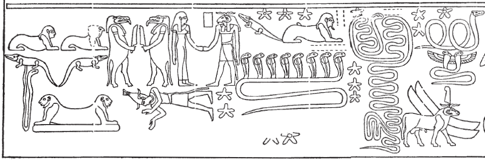
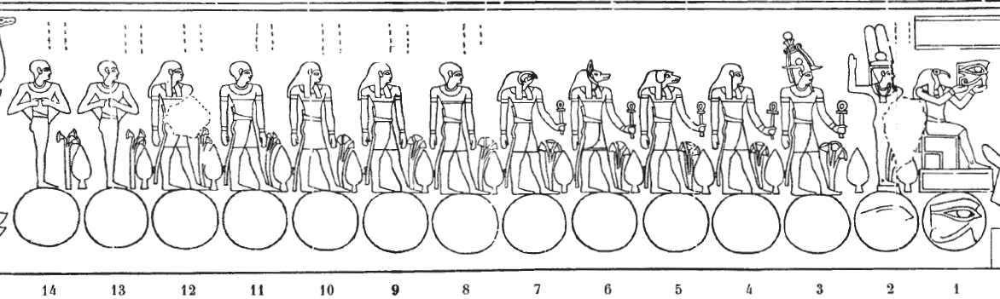
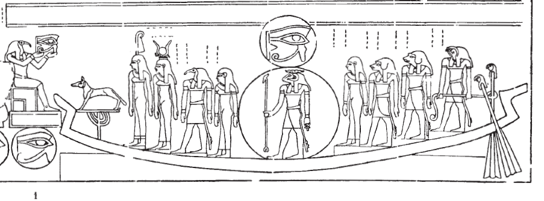

# Row A (399-404) {-}

## Esna 399 {-}

  

- Location: Travée A
- Date: Trajan or Geta 
- [Hieroglyphic Text](https://www.ifao.egnet.net/uploads/publications/enligne/Temples-Esna004.pdf#page=35){target="_blank"}  
- Bibliography: @lieven-himmel, pp. 15-19; @altmann-mond, pp. 606-612.  

**A** Various constellations and celestial beings    

[Color photograph](https://flic.kr/p/2nzufZB){target="_blank"}  
  
{width=100%}  
  
**B** 14 gods stand over phases of the moon   
   
[Color photograph](https://flic.kr/p/2nzvDtP){target="_blank"}  
   
{width=100%}  
  
**C** Divinities accompany Khnum-Re in the solar bark  
  
[Color photograph](https://flic.kr/p/2nzvDtt){target="_blank"}
  
{width=100%} 

**D** Text over the bark  
[Photograph after cleaning with text not seen by Sauneron. Credit: Ahmed Amin](https://uni-tuebingen.de/fileadmin/_processed_/8/8/csm_20-11-10_07_Sternbilder_cead7d7fd3.jpg){target="_blank"}   
[Additional photograph 1](https://flic.kr/p/2nW8cqQ){target="_blank"}  
[Additional photograph 2](https://flic.kr/p/2nzufZX){target="_blank"}  
[Additional photograph 2](https://flic.kr/p/2nzvDtt){target="_blank"}   

^1^ *Ḫprỉ wr m dwȝw*  
*wḥm rnp m Nw.t*  
*sḥḏ tȝ.wy rʿ-nb*  
*m ỉrw=f n Ỉtm*  
*ḏȝỉ r Mȝ(nw) rʿ-nb*  
*m ỉrw=f*   
*n ḥỉšš(?)*  
*ḥtp m ʿnḫ.t*  
   
^1^ Great Khepri in the morning,  
who rejuvenates in Nut,    
and illumines the two lands, daily,    
in his form of Atum;   
who sail to Ma(nu?), daily,     
in his form   
of the hippocampus(?)[^fn-399-5]    
setting in the West.  

[^fn-399-5]: The first vertical sign is unclear (see the color photographs linked above), but this appears to be the same name attested for a seahorse-shaped serpent, which is also attested above in [Esna 399], A (upper right corner): see @seahorse. The reading of that figure's caption was discussed by [Christian Leitz](https://youtu.be/WGZiRJfNYZI?t=1198).