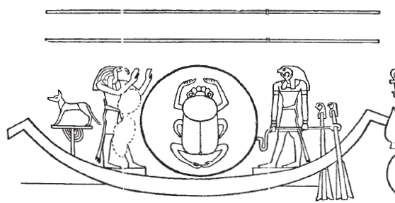
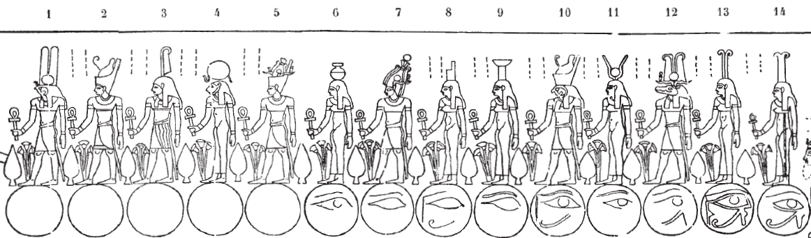
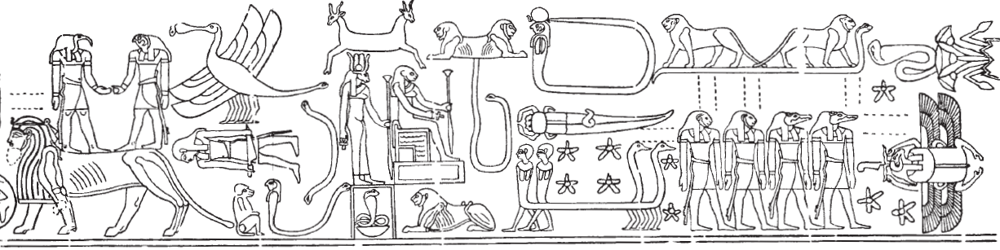

## Esna 401 {-}

- Location: Travée A
- Date: Trajan or Geta 
- [Hieroglyphic Text](https://www.ifao.egnet.net/uploads/publications/enligne/Temples-Esna004.pdf#page=40){target="_blank"}  
- Bibliography: @lieven-himmel, pp. 29-33; @altmann-mond, pp. 606-612.  

**A** Thoth and Horus with a scarab-sun in the solar bark      
  
{width=45%}  
  
[Color photograph](https://flic.kr/p/2nzufZB){target="_blank"}   
  
**B** 14 Divinities standing on phases of the moon        
   
[Color photograph](https://flic.kr/p/2nzugcf){target="_blank"}  
    
{width=100%}  
  
**C** Various Astral Beings   
  
[Color photograph after cleaning. Credit: Ahmed Amin](https://uni-tuebingen.de/fileadmin/_processed_/8/8/csm_20-11-10_07_Sternbilder_cead7d7fd3.jpg){target="_blank"}  
[Additional photograph](https://flic.kr/p/2nzvDtt){target="_blank"}   
   
{width=100%}  
  

