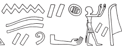

# Architrave A (405) {-}

## Esna 405 {-}

  

- Location: Architrave A
- Date: Septimius Severus, Caracalla, Geta
- [Hieroglyphic Text](https://www.ifao.egnet.net/uploads/publications/enligne/Temples-Esna004.pdf#page=45){target="_blank"}  
- Epigraphic Copy: Esna IV/2, [Pls. I-II](https://www.ifao.egnet.net/uploads/publications/enligne/Temples-Esna004.pdf#page=156){target="_blank"} 
- Bibliography: @lieven-himmel, pp. 34-40; @altmann-mond, pp. 615-616 (excerpts); @recklinghausen-severus (for the painted cartouche; *non vidi*).

^1^ *wnn Rʿ ḥr wbn m bȝẖw*  
*r ḥfd r ḥr.t *  
*sw (m) ʿpy*  
*psḏ(.w) nn ḥȝtỉ*   
*ẖnmw nb Ỉs.t*  
*wbn m-ḫnt=s*  
*sḥḏ.n=f p.t*  
*m wbn=f*  
   
*sḥḏy*  
*sqdd m Nw.t r ȝḫ.t*  
*ḥȝy.ty [...]*  
*[...]=f*  
*m-ʿqȝ n b(w)=f ḏsr*  
   
*ẖnm.n=f nṯr nṯry*  
*m rn=f n ẖnmw wr*  
*wbn m ỉȝbt.t*  
*ḏȝỉ p.t*  
*nn wrḏ.n=f*  
   
*dỉ=f sw m ȝḫ.t*  
*m bȝ m 4 ḥr.w*  
*ḥr* ^2^ *nḥb.t wʿ.t*  
  
^1^ When Re rises from Bakhu    
to fly up to the sky,  
he is (as) a winged scarab  
who shines without cloud cover,  
(namely) Khnum, lord of heaven,  
who rises within it,  
having illumined the sky,  
with his rising.  
   
The luminous one (Re),  
who sails in Nut to the Akhet,  
while the two luminaries [...]  
[...] he/him,   
across from his sacred place.  
  
He united (*ẖnm*) with the divine god,  
in his name of Great Khnum (*ẖnmw*),  
he who rises from the East[^fn-405-1],  
and sails across the sky,  
never tiring.   
  
He reveals himself in the Akhet   
as a Ba-ram with four faces    
upon ^2^ a single neck.[^fn-405-2]  

[^fn-405-1]: {width=18%} - @lieven-himmel, p. 34, n. e, did not read the location from which Khnum rises, whereas Kurth had previously suggested "Akhet." Both authors seem to have been influenced by the typeset hieroglyphs, since in the epigraphic copy it is evident that the tall sign with dots is not *ḏȝỉ*, "to sail". Rather, it is a deconstructed Eastern standard (*ỉȝbt.t*), here placed after its usual determinatives (arm and land sign), and the bottom pole rendered as a small rectangle. The following verb *ḏȝỉ* is written with the ideogram of a boat.
[^fn-405-2]: This text suggests the daytime sun disk itself is a manifestation of the four-headed ram of Mendes. This is precisely what is depicted in [Esna 437], 6, where the day bark shows the Mendesian ram, between two barks with a child (morning sun) and old ram-headed man (evening sun): {width=45%}. See a similar description in *Esna* II, 48, B, and [Esna 431], 2 (with a nice ideogram).

*tỉ.t=f ḏsr(.t)*   
*m ỉty nḫt*  
*ḥr mʿbȝ Wȝmmty m ȝ.t=f*  
*zȝ wỉȝ=f r tȝ-ʿnḫ*  
*nw r tȝ m gb.t*  
*rʿ-nb*  
*r snsn sḫm=f šps*  
   
*ḥm=f m Pr-nṯr m ḥʿʿ*  
*s.t=f pw n rsy*  
*bȝ=f m p.t*  
*ḥr wbn ḥtp*  
*ḥr mȝȝ tp nfr rʿ-nb*  
  
His august image  
is the mighty sovereign crocodile,[^fn-405-3]  
harpooning Wamemty in his moment;[^fn-405-3b]  
who protects his bark until the West,   
who returns to the earth from the sky,  
daily,   
to unite with his august image.  
  
His Majesty is in Per-netjer, in joy,   
for it is truly his place;[^fn-405-4]  
while his Ba is in the sky,  
rising and setting,  
viewing all goodness, daily.  
   

[^fn-405-3]: {width=20%} - @lieven-himmel, p. 34, n. f, suggested the crown is unlikely for a simple word like  "Sobek" or "crocodile", and suggested axm, "divine image" (which would be a tautology here); @kurth-olz, p. 26, asserted it must be "Krokodil." Nonetheless, the crocodile with the double plumes elsewhere writes *ỉty*: @gamelin-2019, p. 40 (with notes), and the same epithet applies to Khnum Lord of the Field in *Esna* III, 261, 16, 8 and *Esna* VII, 619, 46. Shemanefer, the crocodile manifestation of Khnum Lord of the Field, also frequently bears the epithet "sovereign."

[^fn-405-3b]: Multiple festival texts describe how Khnum-Shu Lord of the Field protects Re-Atum from his enemies on multiple occasions. Here this local theology is applied to the daily course of the solar bark, and defeating Apophis (Wamemty).  

[^fn-405-4]: {width=16%} - @lieven-himmel, pp. 34, n. h, and 35, n. h, understood *rsỉ* as "southern", and suggested this phrase alludes to Esna's position in Upper Egypt. However, Per-netjer, the location of Khnum's august image (the mummified Atum) was notably *north* of Esna temple proper. Moreover, this determinative primarily occurs in the particle *rsỉ*, "very; thoroughly": *Wb.* II, 453, 16-18.

*ḥtp ỉtn m mšrw*  
*ỉʿḥ m (ỉt)n=f*  
*ẖnm=f p.t*  
*ḥȝy=f ỉmy.w dwȝ.t*  
*ḫsr.n=f kkw*  
*sr.n=f šzp*  
*m ʿ.t ỉmn(.t)*  
*dỉ(=f) sw m ỉmḥ.t*  
*m ỉȝw n nḥḥ*  
   
*ỉȝw zp-snw*  
*ỉn ỉmy.w*  
*ỉmn m Ỉtm*  
^3^ *wḥm ms.w m ḫy rʿ-nb*  
  
When the sundisk sets in the evening,  
the moon is its (substi)tute,  
it joins with the sky,  
and it lights up those within the Duat;  
as it repelled darkness,  
so it announced light,  
in the Hidden Chamber;  
he appears in the grotto   
as an old man of eternity.[^fn-405-4a]  
   
'Praise, praise!'  
(So say those who are there)[^fn-405-5]  
He who is hidden as Atum,  
^3^ who repeats births as a child,[^fn-405-6] daily.  

[^fn-405-4a]: The determinative of *ỉȝw* depicts an old man with a ram head, a typical representation of Atum at night time. For example, nearby in [Esna 399], C.

[^fn-405-5]: {width=18%} - @lieven-himmel, p. 36, n. k, assumed this was an epithet of Atum: *ʿn ỉnḥ.wỉ(?)*, "Mit-schönen-Augenbrauen(?)." However, the particle *ỉn* is frequently spelled *ʿn* at Esna: e.g. *Esna* III, 284, 2; 358, 34. The eyebrows can write *ỉmỉ.w*, but one would expect a following location. Presumably this is simply a variant of *nty.w-ỉm*, "those who are *there*", a euphemism for the deceased (*Wb*. II, 355, 9-10).

[^fn-405-6]: {width=6%} - @lieven-himmel, pp. 36-37 transcribed this as *m ʿnḫ*, "in life", without further comment. Instead, this is most likely just the word *ḫy*, "child", with the determinative atypically above the uniliteral sign. 

*dỉ=f ʿḥʿ *  
*ḥr psḏ m Nw.t*  
*[...] *  

*ỉwn-ḥʿʿ*  
*psḏ m smd.t*  
*ḥr wḥm qy=f*  
*tp dwȝw nn ȝb*  
*r tr=sn*  
   
*m spr bȝ=f m ḥr.t*  
*ḥr wḥm msḫʿ.w*  
*m-ʿqȝ tỉ.t=f*  
*m ẖnn=f Ỉtm*  
*m-ḥȝ.t zȝ.w-n=sn*  
*ḥr zȝ ȝḫty.w*  
*ỉmỉ.w dwȝ.t štȝ.t*  
*ḥr ỉr(.t) zȝw [///]*  
    
He spends(?) the midday  
shining in Nut  
[...]  
  
The moon,  
who shines on the 15th day,    
repeating his form in the morning,  
without fail in their seasonality;    
   
When his Ba reaches the sky,   
repeating luminous births,  
across from his image,  
as he approaches Atum,  
at the head of the Guardian Deities;[^fn-405-7]    
protecting the luminous stars,    
who are within the remote Duat;    
carrying out protection [...]  

[^fn-405-7]: This section appears to refer to the related lunar scenes nearby: [Esna 399], C. The full-moon on the bottom register is immediately across from a solar bark containing a ram-headed solar god, a typical form of Atum. The new moon appears on the opposite side of the wall, before a solar disk featuring Khepri. The related text over the bark hails that god as both Khepri and Atum: [Esna 399], D.