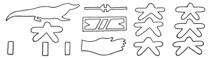

# Row B (406-412) {-}

## Esna 406 {-}

  

- Location: Travée B
- Date: Unknown 
- [Hieroglyphic Text](https://www.ifao.egnet.net/uploads/publications/enligne/Temples-Esna004.pdf#page=47){target="_blank"}  
- Epigraphic Copy: Esna IV/2, [Pls. III-IV](https://www.ifao.egnet.net/uploads/publications/enligne/Temples-Esna004.pdf#page=158){target="_blank"} 
- Bibliography: @lieven-himmel, pp. 42-55; @monthemhet, pp. 1023-1024.  
- Parallels: [Esna 400]; [pBM 10662](https://www.britishmuseum.org/collection/object/Y_EA10662){target="_blank"}; pLeiden I 346, 1, 4-6: see @lieven-himmel, Pls. 2a-2c.

^1^ *ỉȝw n=t(n) *  
*nṯr.w ʿnḫ.w*  
*bȝkty.w ỉmy.w ẖr.t-nṯr*  
*psḏ(.w) m (w)ḫ*   
*r-sȝ hrw.w*   
*(ḥr) sỉȝ wnw.wt*  
*m nʿỉ=sn (r) ỉȝbt.t*  
   
*sr(.w) ḫp(r)*  
*sʿnḫ(.w) smȝ(.w) sbỉ.w*  
*r mry=sn*  
   
*psḏ.w m ḥr.t*  
*sṯy(.w) tȝ.wy m nzr.t*  
*sdȝdȝ ḥr.w-nb.w m pr=sn*  
*wnwn.w*   
*wn wn.wt*   
*m tr=sn*  
  
^1^ Praise unto you,  
living gods,  
working stars within the Necropolis,[^fn-406-0]    
who shine during the night,  
after the celestial disks (sun and moon),   
making hours perceptible     
via their transit to the East.[^fn-406-1]  
  
Those (stars) who announce what will happen,  
who keep alive and massacre enemies  
as they desire.  
  
Those who shine in the sky,  
who light up the two lands with fire,  
at whose emergence everybody trembles:  
the running stars (*wnwn.w*),   
at whose appointed times  
the hours exist (*wn wn.wt*).   

[^fn-406-0]: This text is dedicated primarily to the decan stars, who are depicted nearby in: [Esna 407] and [Esna 409].
[^fn-406-1]: A reference to reckoning hours of the night by tracking movements of the decan stars.

*ỉnḏ* ^2^ *ḥr=tn*  
*ms.w Rʿ*  
*ḫʿỉ(.w) m ḥtp=f*  
*psḏ.t nt pȝwty.w tpy*  
*pẖr=sn ḥr nmt.t=f rʿ-nb*  
*bȝ.w ʿnḫ.w nw nṯr.w rʿ-nb*  
*pẖr=sn m ỉr.t Rʿ *  
   
*wpwty.w m nỉw.wt spȝ.wt*  
*sṯy.w šsr.w=sn m r'=sn*  
*r gmḥ=sn wȝ(.w)*  
   
*sbȝ.w sšd.w mỉ rʿ-nb*  
*nhm(.w) nb=sn *  
*m-ʿ* ^3^ *ỉḫt nb ḏw*  
*m-ʿ sṯỉ n sbȝ.w*  
*m hrw pn m ȝbd pn*  
*m ȝbd pn m rnp.t tn*  
*m wn.wt=sn nb.w*  
*r-mn mỉn*  
   
Greetings ^2^ to you,   
Children of Re,    
who appear when he sets.  
The Ennead of the First Primeval one,    
they encircle his steps, every day;    
the Living Bas of the gods, daily,    
who go about from the Eye of Re.  
    
The messenger-stars in cities and nomes,   
who shoot their arrows from their mouths,    
to whomever they glimpse from afar.  
   
The stars who perpetually shine,[^fn-406-2]      
who rescue their lord,  
from ^3^ any evil thing,  
and from the shooting of the stars,  
on this day in this month,   
in this month in this year,    
in all their hours,   
up until today.  

[^fn-406-2]: {width=22%} - Previous translators have understood this to be a group called "the Six stars." However, this is more likely just a sportive writing of *sbȝ*, "star", which at this point was roughly homophonous with the word for "six" (*sỉw*): @herbin-ldpe, p. 95; @winkler-rde, pp. 243-244. For the qualifier *sšd*, "shining; dashing" used to describe stars, see @winkler-rde, pp. 238-241.  

*Knm.t ʿpr.tw*  
*tp nṯry.w m pẖr=sn*  
  
*bȝkty.w ʿnḫ.w *  
*ḥr ỉr(.t) ỉrw=sn m wḫ*  
*r sḫn*   
*m-ḫt sȝḥ ḥnʿ spd.t*  
*ḥr sḫd=f r dwȝ.t*  
*n.t nṯr ʿȝ m ỉmnt.t*  
*r šms=f m-ḫt wrḏ.n=f*  
*r ḥn.ty rʿ-nb*  
  
Kenmet is equipped,  
heading the divine-stars in their orbit.[^fn-406-3]  
  
The living- and the working-stars  
perform their duties in the night,  
until alighting (i.e. culminating)    
following Orion and Sothis,  
when he descends into the Duat   
of the Great God in the West,  
to serve him after he became tired,  
for the limits of eternity, every day.[^fn-406-4]    

[^fn-406-3]: Kenmet is typically the chief decan star, and is represented below in first position in [Esna 407], 3.  

[^fn-406-4]: The theme of the living-stars and working-stars following Orion beneath the horizon is continued in [Esna 408].