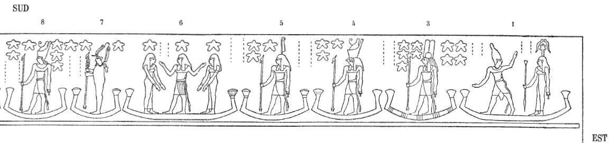
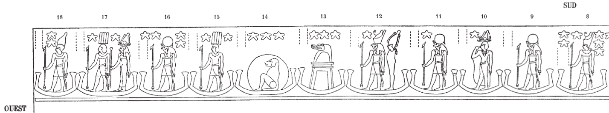

## Esna 407 {-}

- Location: Travée B
- Date: Unknown 
- [Hieroglyphic Text](https://www.ifao.egnet.net/uploads/publications/enligne/Temples-Esna004.pdf#page=48){target="_blank"}  
- Bibliography: @lieven-himmel, pp. 56-59.  
- [Color photograph of first scene. Credit: Ahmed Amin](https://uni-tuebingen.de/fileadmin/_processed_/1/6/csm_20-11-10_08_Esna_Sternbild_Orion_d8ff011988.jpg){target="_blank"}  
  
Orion and various decan stars.  
  
{width=100%}  
  
  
{width=100%}
