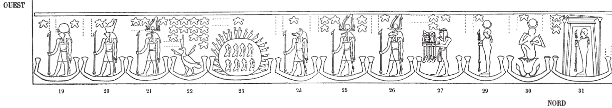
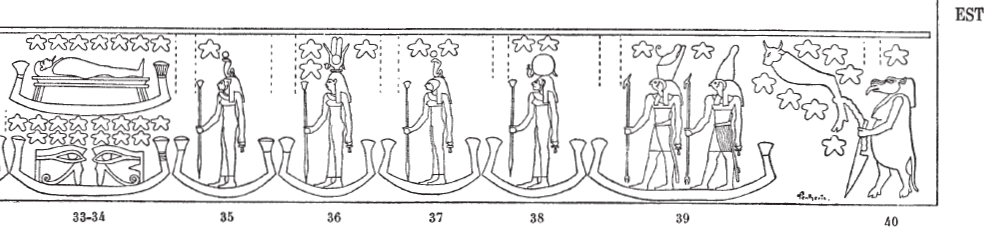

## Esna 409 {-}

- Location: Travée B  
- Date: Unknown  
- [Hieroglyphic Text](https://www.ifao.egnet.net/uploads/publications/enligne/Temples-Esna004.pdf#page=51){target="_blank"}  
- Bibliography: @lieven-himmel, pp. 64-65.   
- [Color photograph of middle scene (33-34). Credit: Ahmed Amin](https://uni-tuebingen.de/fileadmin/_processed_/4/e/csm_20-11-10_10_Sternbild_Mumie_ea53059771.jpg){target="_blank"}  
- [Color photograph of final scene (40). Credit: Ahmed Amin](https://uni-tuebingen.de/fileadmin/_processed_/e/5/csm_20-11-10_09_Sternbild_Grosser_Wagen_ef04dbc553.jpg){target="_blank"}  
   
Various decan stars, continuing [Esna 407].  
  
{width=100%}    
  
  
{width=100%}    

