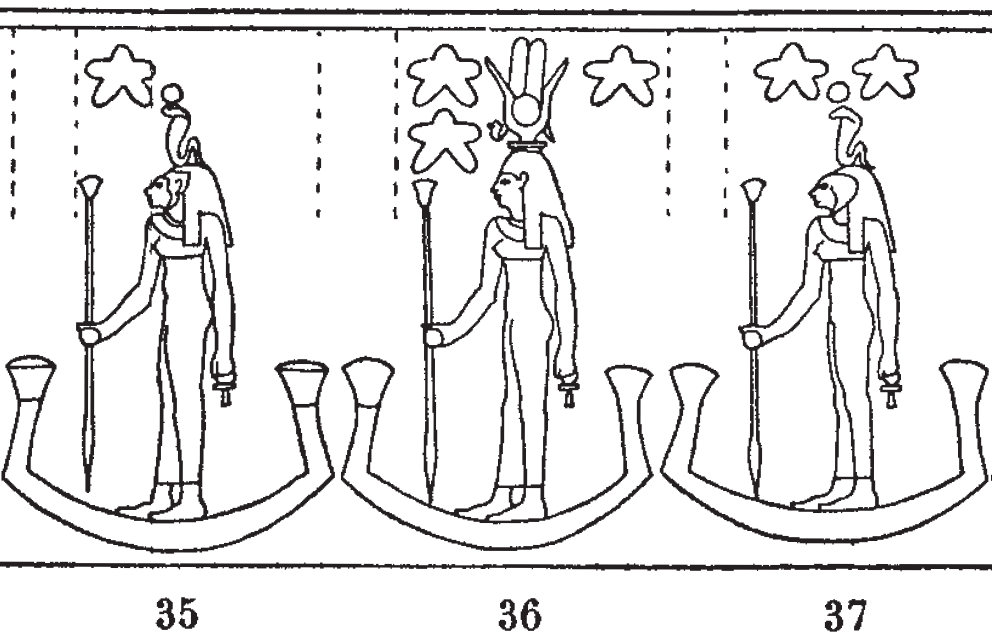

## Esna 415 {-}

  

- Location: Travée C
- Date: Autokrator Caesar (unknown Roman emperor)
- [Hieroglyphic Text](https://www.ifao.egnet.net/uploads/publications/enligne/Temples-Esna004.pdf#page=61){target="_blank"}  
- Bibliography: @lieven-himmel, pp. 78-81; @mendel-himmel, II, pp. 428-429.  
  

*wnn ỉȝ.t-ṯȝ.wy*  
*ḥts.tw r ȝḫ.t*  
*ẖr ỉwn wr*  
*ḏsr.tw r Nw.t*  
*ẖr ḫnty-ỉtr.ty šmʿ*  
*psḏ.n=s*   
*ḫnty-ỉtr.ty mḥw*  
*m-ḫnt=s*  
*mỉ ỉtn.wy*  
   
*gnẖ.wy ỉry*  
*(ḥr) sqd m-ḫt=f*  
*ḥr šms=f r-mn mỉn*  
   
*ḫȝbs.w m pẖr=f*  
*ḥr ỉr(.t) n=f bȝk=sn*  
  
So the Mound of the Chicks,  
is adorned like the Akhet   
bearing the Great Pillar (Khnum);  
it is made sacred like Nut,  
bearing Foremost of the Southern Chapel;  
it shines  
while Foremost of the Northern Chapel  
is within it,  
just like the two disks.[^fn-415-1]  
  
The stars, meanwhile,  
sail after him,  
serving him even until today.  
  
The decan stars surround him,  
performing their work for him.  
   

[^fn-415-1]: A similar grouping of Khnums occurs in [Esna 433]. There, Foremost of the Southern chapel is the night sun who visits the underworld (line 2), while the "Great Pillar" shines in the sky like Re (line 3). Khnum is also a Pillar and Foremost of the Two Chapels in *Esna* III, 367, 16-17; see also 262, 23, §19. Khnum receives similar epithets specifically when he illumines the sky, in *Esna* II, 17, 53-54; III, 249, 2 (16). In the present passage, the twin forms of Khnum (Southern and Northern chapels) appear to be linked with the sun and moon. 

*rmn(.t)-ḥr.t*  
*mḥn=s ḥr tp=f*  
*ẖr(.t)-hrw*  
*m rn=s n Mnḥy.t*  
   
*rmn(.t)-ẖr.t*  
*sšd=s m dwȝ.t=k*  
*m ỉsb.t wr.t*  
*m rn=s n Nb.t-ww*  
   
*wbn=k ḥtp=k ỉm=w*  
*rʿ-nb*  
   
*nsw.t-bỉty*  
*nb tȝ.wy*  
*(ỉtwkrtyrs kysyrs)|*  
*ʿnḫ(.w) ḏ.t nḥḥ*  
   
The Upper Shoulder,   
she coils upon his head,      
every day,  
in her name of Menhyt.  
  
The Lower Shoulder,  
she shines in your Duat,  
as the great uraeus serpent,  
in her name of Nebtu.[^fn-415-2]  
  
As you rise, so you set through them,    
every day.  
  
King of Upper and Lower Egypt,    
Lord of the Two Lands,   
(Autokrator Caesar)|  
living for all eternity!
 

  

[^fn-415-2]: As @lieven-himmel, p. 80, noted, these two epithets are also names of decans, technically the two shoulders of Orion (aka Betelgeuse and Bellatrix). See also: *LGG* IV, 669b. As such, they appear in [Esna 409], numbers 35 and 37: {width=35%}. The two lion-headed decans are linked two Khnum's consorts in a theologically significant manner: Menhyt serves as the uraeus upon Khnum-Re of Esna by day, while Nebtu unites with Khnum Lord of the Field in North Esna, visiting the deceased gods within the local Duat during the festival of Khoiak. See especially *Esna* III, 346, 19ff. The complex emendations suggested by @lieven-himmel, p. 78, n. b, are unnecessary. 
