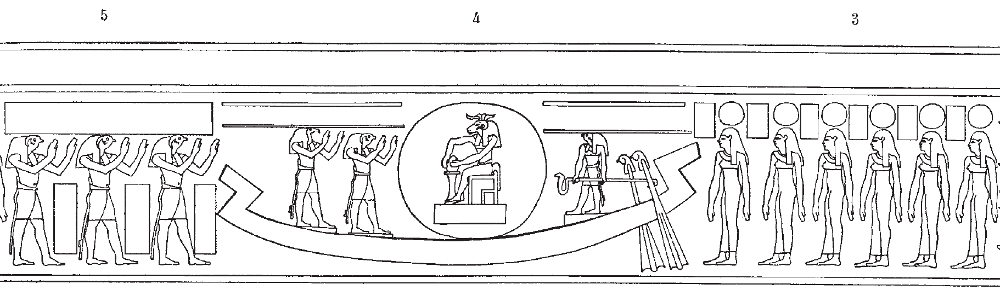

## Esna 416 {-}

  

- Location: Travée C
- Date: Unknown 
- [Hieroglyphic Text](https://www.ifao.egnet.net/uploads/publications/enligne/Temples-Esna004.pdf#page=62){target="_blank"}  
- Bibliography: @lieven-himmel, pp. 81-82; @altmann-mond, pp. 620-621; @mendel-himmel, II, pp. 429-432. 
   
{width=80%}  
   
**1**  Bark with child inside solar disk (morning sun) ([Color photograph](https://flic.kr/p/2nzueWC){target="_blank"}).    
  

^1^ *nsw.t-bỉty *  
*nfr-ḥr*  
*ḫʿ.tw ḥr srḫ*  
*(ḥr) bd(.t) st.wt*  
*m-ḫt pr=f*  
   
^1^ The King of Upper and Lower Egypt,   
beautiful of face,    
appears upon the *serekh*,  
emitting his rays    
after he comes forth.  

  
**2**  Adoring rekhyt figures ([Color photograph](https://flic.kr/p/2nzugdn){target="_blank"}).    
  

^2^ *rḫy(.t) nb.w*  
*m ʿy m ḥr=k*  
*ḥr dwȝ=k rʿ-nb*  
  
^2^ All rekhyt-people  
are in jubilation before you,  
worshipping you every day.

  
{width=80%}  
  
**3**  First six hours of the day ([Color photograph](https://flic.kr/p/2nzwJmD){target="_blank"})    
  
**4-5** Bark with Khnum inside a solar disk (midday sun), worshipped by three gods (the Bas of Pe) ([Color photograph](https://flic.kr/p/2nzwJsF){target="_blank"})     
  
Text over the bark:  

^3^ *swḥ n ʿnḫ*  
*ỉw m p.t r tȝ*  
*mn m ẖ.t*  
  
^3^ The breath of life,  
who comes from the sky to the earth,   
and dwells within the body.  

Text over the Bas of Pe (not copied by Sauneron or Mendel):  

*[...] ỉb*  
*ḥr dwȝ=sn nṯr*  
*twt(.w) ḥr šms=f*  
*rʿ-nb*  
     
[...] of heart,  
as they praise god,  
being united in his service,  
every day.  
  

  
{width=80%}  
   
**6** Last six hours of the day ([Color photograph](https://flic.kr/p/2nzueZZ){target="_blank"}).    
   
**7-8** Bark with old man inside a solar disk (evening sun), worshipped by three gods (the Bas of Nekhen).   
  
Over the bark:    

^4^ *Ḫprỉ *  
*ỉȝw rnp*  
*zbỉ ḏ.t*  
*ḥtp m dwȝ.t*  
*m ẖ.t Nw.t*  
  
^4^ Khepri,  
the old man who rejuvenates,    
who traverses eternity,  
and rests within the Duat,  
through the belly of Nut.

  
Over the Bas of Nekhen (text only in Mendel):      

  
*[...]*  
*ḫnty n ẖr.t-nṯr*  
*ḥr ỉr(.t) ỉȝw n [nb=sn?]*  
*m dwȝ.t štȝ.t*  
   
[...]   
foremost of the Necropolis,   
making praise for [their lord?]  
in the mysterious Duat.  

