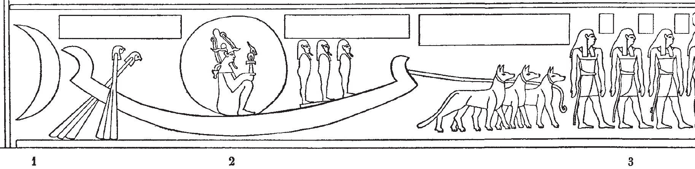
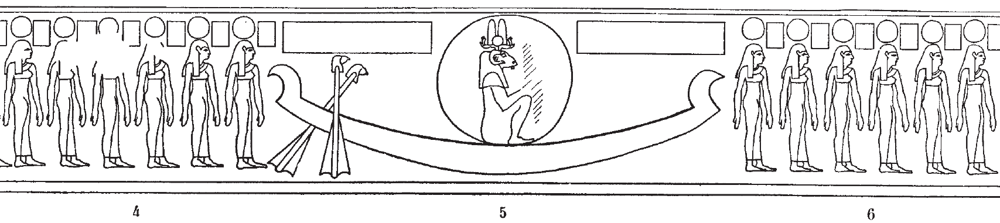
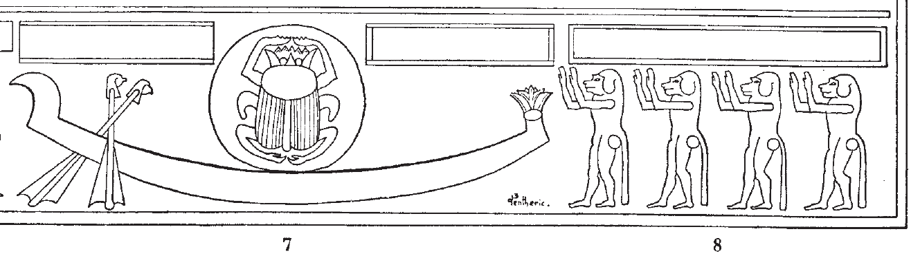

## Esna 418 {-}

  

- Location: Travée C
- Date: Unknown 
- [Hieroglyphic Text](https://www.ifao.egnet.net/uploads/publications/enligne/Temples-Esna004.pdf#page=64){target="_blank"} 
- Bibliography: @lieven-himmel, p. 88; @altmann-mond, pp. 620-621; @mendel-himmel, II, pp. 433-436. 
   
{width=80%}  
   
**1-3**  Three jackals tow a bark containing the moon, in which Osiris sits. Only fragments of the captions are preserved in painted decoration: @mendel-himmel, pp. 435-436.    
  
{width=85%}  
  
**4-6** Bark with solar disk, in which Re sits. Preceded and followed by hours of the night (painted stars are on their heads: [Color photograph](https://flic.kr/p/2nzwJsF){target="_blank"})    
    
Text over the bark:  

*nsw.t-bỉty*  
*bȝ šps [...]*  
*štȝ ms.wt*   
*ms nṯr.w dwȝ.t(?)*    
   
The King of Upper and Lower Egypt,  
the august Ba [...]  
mysterious of births,  
who births the gods of the Duat(?).  

{width=75%}  
   
**7-8** Bark with scarab inside a solar disk (morning sun), worshipped by four baboons ([Color photograph](https://flic.kr/p/2nzueWC){target="_blank"}).    
  
Text over Khepri (painted, only partially in Sauneron and Mendel):   
   

  
*ḫprr wr*  
*[ʿp]y(?) rʿ-nb*  
*wsn pw *  
*ỉr nḏmnḏm m nḥḥ*  
  
The great scarab,  
who [fli]es(?) up every day;   
he is the lusty (ram),   
who makes sexual pleasure for eternity.  
   

Text over baboons (pained, see @mendel-himmel, p. 434):  

*Ỉsdn wr*  
*ỉp wḏȝ.t m ḫprw=f*  
*dwȝ ỉt=f Rʿ*  
*m ỉrw=f n hṯt*  
  
Great Isden,  
who reckons the *wedjat*-eye in his manifestation,   
who praises his father, Re,    
in his visible form of a chattering baboon.

