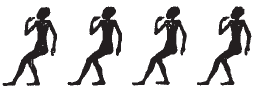

# Architrave C (422-423) {-}

## Esna 422 {-}

  

- Location: Architrave C
- Date: Unknown
- [Hieroglyphic Text](https://www.ifao.egnet.net/uploads/publications/enligne/Temples-Esna004.pdf#page=69){target="_blank"}  
- [Epigraphic Copy](https://www.ifao.egnet.net/uploads/publications/enligne/Temples-Esna004.pdf#page=164){target="_blank"}  
- Bibliography: @lieven-himmel, pp. 90-94; see also [Tempeltexte 2.0](http://www.tempeltexte.uni-tuebingen.de/portal/#/text-detail/2736){target="_blank"}  

^1^ *nfr.wy ḥr=k*  
*ỉw=k ḫʿ.tw*  
*m p.t mḥt.t*  
   
*ỉt ỉt.w pw *  
*n nṯr.w*  
*ẖnmw-Rʿ nb tȝ-sn.t*  
*nṯr ʿȝ*  
*nb ḥw.t-ẖnmw*  
  
*psḏ=k m ỉtn=k*  
*m-ḫt Nw.t*  
*mỉ psḏ-m-mḥn=f*  
   
*sḥḏ=k tȝ.wy ỉry*  
*m nbỉ.t=k*  
*sš.n=k gs.w-pr.w*  
*wn.n=k ỉz.ty [...]*  
   
*dwȝ.tw ḥm=k *  
*m kȝr^2^=k šps *  
*snỉ.tw sšp=k*  
*m ȝḫ.t rʿ-nb*    
  
^1^ How beautiful is your face!      
When you appear  
in the northern sky.  
   
That means: father of fathers    
of the gods,  
Khnum-Re Lord of Esna,  
great god,  
Lord of the Temple of Khnum.  
  
You shine in your disk  
in the belly of Nut,[^fn-422-1]  
like He who Shines in his Uraeus (Re).  
  
You illumine all the lands  
with your flame;  
as you opened the temples,  
so have you opened the dual chapels [...]  
  
One worships your majesty  
in your ^2^ august shrine;    
one reveres your radiance    
in the Akhet, every day.  

[^fn-422-1]: This section possibly refers to the nearby image of Khnum at the potter's wheel (i.e. Khnum-Re Lord of Esna) depicted inside a solar disk as the midday sun in [Esna 416], scene 3.  

*bd.n=k knḥ*  
*sʿr.n=k šzp*  
*tkk.n=k ỉgp*   
*r tȝ pn*  
   
*nḥp=k pʿy.t*  
*qd.n=k rḫy.t*  
*ỉr.n=k ʿnḫ ḥnmm.t*  
   
*qmȝ.n=k nṯr*  
*sḫpr.n=k nṯr.t*  
*sḫr.w nty psḏ.t*  
   
*msỉ.n=k ḥmww.w*  
^3^ *nty nbỉ ʿḫm.w*  
*ms.w ms.w=k ỉm=sn*  
   
*mḥ.n=k ḥm.wt m snb*  
*m nh m nḫn*  
*m ṯȝy.w ḥm.wt*  
   
*sḫpr.n=k ʿnḫ m ʿnḫ.w*  
*mḥ.n=k fnḏ *  
*m ṯȝw n ʿnḫ*  
*šr.n=k šr.ty nb*  
*m mḥy.t nfr.t*  
   
*wn.n=k r'*  
*sš.n=k sp.ty [...]*  
   
As you illumined darkness,  
so you made light ascend,  
having attacked clouds   
away from this land.  
  
As you fashioned the elites,  
so you modelled the commoners,  
and you made life for the sunfolk.  
  
You created the god,  
and produced the goddess,  
and the conditions of the Ennead.  
  
You birthed the artisans,  
who fashion divine effigies,  
and who thus birth your children thereby.  
  
You fill women with health,  
while protecting the child,[^fn-422-2]  
whether male or female.    
  
You have created life for the living,    
you filled the nose  
with the breath of life,  
you (un)blocked all nostrils  
with the good north-wind.  
  
As you opened the mouth,  
so did you open the lips [...]

 

[^fn-422-2]: {width=15%} - The first three child signs are uniliterals, the final a determinative. 
