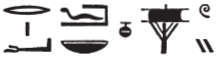

## Esna 425 {-}

  

- Location: Architrave C
- Date: Titus
- [Hieroglyphic Text](https://www.ifao.egnet.net/uploads/publications/enligne/Temples-Esna004.pdf#page=73){target="_blank"}  
- [Color photograph](https://uni-tuebingen.de/fileadmin/_processed_/f/0/csm_22-05-17_Esna_Tempel__3__881ca5748c.jpg){target="_blank"} (far left)
- Bibliography: @lieven-himmel, pp. 104-107.
- Parallels: Many of the phrases find corresponding expressions in the symmetric text [Esna 427].

NB: This text and [Esna 427] include multiple epithets identifying Neith with a cobra (Wadjyt) and vulture (Nekhbet). These clearly relate to the series of vulture- and cobra-headed vultures on the central panel of the ceiling: [Esna 426].

*psḏ ḥr(.t)-wȝḏ=s *  
*m sḫ.t wʿb.t*  
*m snn=s n ỉqḥ.t štȝ.t*  
*spr=s tȝ-sn.t m ȝw(.t)-ỉb*  
   
*wn=s ʿ.wy=s*  
*ḥr nbỉ ḥw.t-ṯȝ.wy*  
*ḥr mk(.t) nṯr.w m ḥw.t-N.t*   
*sȝq=s dnḥ=s*  
*ḥr ḫwỉ(.t) Rs(.t)-ḥw.wt=s*  
  
*zȝ=s ḏd šps*  
*m ʿḥ=f ṯn*  
*ḫʿỉ=s m pr=f*  
*psḏ=s m ḥr.t-tp=f*  
*dỉ=s šsr=s*  
*r wȝỉ ỉm=f*  
  
She She stop her Papyrus shines,[^fn-425-1]  
from the pure field,  
in her form of the mysterious vulture,  
having reached Esna in happiness,   
  
She opens her arms (i.e. wings):  
protecting Temple of the Chicks,   
guarding the gods in the Temple of Neith.    
She joins together her wings,    
while protecting *Rs.t-ḥw.wt=s*.[^fn-425-2]    
   
She guards the August Djed-pillar  
in this his palace;  
she appears from his temple,  
and she shines as the uraeus on his head,  
and she sets her arrows  
against whomever would plot against him.  

[^fn-425-1]: This is an epithet of the serpentine Wadjet nearby in [Esna 426], 16; see also *LGG* V, 437c-438a. It is also a good description of the cobra on a papyrus which appears in [Esna 401], C, top right corner. 

[^fn-425-2]: For Neith as a vulture protecting Re and other divinities within Esna, see especially [Esna II, 160](https://bookdown.org/shemanefer/Esna2/intercolumnar-wall-f-and-south-east-door-57-64.html#esna-60), 2-3. It appears something is missing after the verb *ḫwỉ*. *Rs.t-ḥw.wt=s* is an epithet of Neith, so presumably she should be the one protecting other divinities.

*ḫp(r)=s m ỉȝbt.t=f*  
*mȝȝ=f m st.wt=s*  
   
*n.t*  
*bỉty(.t) n=f mḥw*  
*ḫpr š-n-Ḥr m ḥtp*  
*r s.t-rd.wy=f*  
  
*rdỉ ỉw nb n kkw*  
*ḏr-nty ntf nb ndb.t*  
*ḥqȝ mnḫ m tȝ r-ḏr=f*  
*ḥr ỉr(.t).n=f*  
   
*dỉ ỉȝ.t-ṯȝ.wy m ršw*  
*ḥr dỉ(.t) ḥfnw m rnp.wt*  
*n zȝ-Rʿ*  
*nb ḫʿ.w*  
*(Wspsyns nty-ḫwỉ)|*  
*mry ẖnmw-Rʿ nb sḫ.t*  
*Šw zȝ-Rʿ*  
  
She transforms into his left-eye,  
so he might see from her rays.  
    
She of the red crown (*n.t*),  
who rules Lower Egypt for him;[^fn-425-3]    
the Lake of Horus has become peaceful,     
and restored to its station.  
  
Grant[^fn-425-4] all that comes from the darkness!  
For he is the Lord of the earth,   
effective ruler in the entire land,     
on account of what he accomplished![^fn-425-5]    
   
Place the Nome of the Chicks in jubilation,   
by giving myriads of years    
to the Son of Re,   
Lord of Appearances,   
(Vespasian Augustus)|[^fn-425-5]  
beloved of Khnum-Re Lord of the Field,   
Shu, Son of Re!

[^fn-425-3]: Following @kurth-olz, p. 27, who noted similarities with the symmetric text [Esna 427], which links Nekhbet to the white crown.

[^fn-425-4]: {width=20%} - @lieven-himmel, pp. 104-105, read: *šnʿ ỉyỉ nb m kkw*, "abgewehrt wird jeder, der in der Dunkelheit kommt." However, the symmetric text ([Esna 427]) has a similar formulation, where the verb must be *rdỉ*, "to give":  {width=15%}. This could just be an active participle, further modifying the epithets of Neith. But since both texts add a persuasive argument (*mỉ-nty ntf*...), this might instead be the non-suppletive imperative form, attested in Old Egyptian and later in archaizing texts.

[^fn-425-5]: The emperor Titus incorporated the name of his father, Vespasian, in his royal titulary. That this particular inscription dates to Titus is clear from the symmetric text ([Esna 427]), and nearby cartouches on the central row including the element "Titus": [Esna 426], [Esna 429]. See @sauneron-3, p. 392. Nonetheless, nearby [Esna 431] belongs to Vespasian, and he also appears on the column capitals: [Esna 457], [Esna 458], [Esna 459]. So work on the central row began under Vespasian, but was completed by his Flavian successors Titus and Domitian.