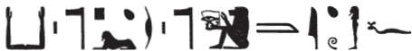

## Esna 432 {-}

  

- Location: Architrave D
- Date: Commodus
- [Hieroglyphic Text](https://www.ifao.egnet.net/uploads/publications/enligne/Temples-Esna004.pdf#page=86){target="_blank"}  
- Bibliography: @altmann-mond, p. 459 (excerpts); @sayed-neith, II, pp. 641-642, Doc. 1043 (excerpts).
  

^1^ *ʿnḫ nṯr nfr*  
*ḥnw.t pw*  
*wbn.tw Rʿ-nb*  
*tmȝ.t pw Rʿ*  
*psḏ ỉtn [...]*  
*[...]* ^2^ *[...]*  
*[...].n=k ms.w n p.t*  
*mỉ mȝȝ=f ỉt-ỉt.w pw*  
*[...]*  
   
^1^ Live the good god,   
that means the mistress of Re(?),     
(of) he who shines every day;    
it is the mother of Re    
the sundisk shines [...]  
[...] ^2^ [...]  
you [...] the children of the sky,   
as he sees the father of fathers   
[...]

^3^ *ʿnḫ nṯr nfr*  
*kȝ psỉ*  
*ỉp wḏȝ.t m ỉrw=f*  
*kȝ-nḫt pw*  
*[...]*  
*[...]* ^4^ *ḥms-wḥʿ(?)*  
*zȝ-Rʿ pw*  
*ḥry nṯr.w*  
*qdỉ (m) šȝʿ*  
*ỉr ỉḫt nb [ʿnḫ?]*  
  
^3^ Live the good god,  
the blazing bull (full moon),  
who reckons the *wedjat*-eye in his form;[^fn-432-1]   
he is the Mighty Bull,[^fn-432-2]   
[...]  
[...] ^4^ while eating,   
he is the Son of Re,    
chief of the gods,    
who built (in) the beginning,   
and makes all [living?] things.  
  

[^fn-432-1]: {width=35%} - @altmann-mond, p. 459, read this quite differently: "der hitzige Stier (?), der die ,,Ferne'' holt mit seiner Gestalt," and noted the unusual spelling of *psỉ*. The sphinx most likely writes the uniliteral *s* here, as elsewhere at Esna: @sauneron-61, pp. 237-238.  For the baboon sign, I have elsewhere argued for the reading *ỉp-wḏȝ.t*, instead of the expected *ỉnỉ-ḥr.t*, "he who brings the distant eye" = "Onuris", based on similar passages at Esna: @klotz-baboons, p. 57). Not only am I unaware of texts which identify the full moon with Onuris, but that epithet is not typically modified with adverbial phrases as here. See also a similar epithet in a newly uncovered inscription in [Esna 418], 8: "Isden the great, who reckons the *wedjat*-eye in his manifestation": @mendel-himmel, p. 434
[^fn-432-2]: This is an epithet for the sun during the full moon, the counterpart to the "Blazing Bull" mentioned above during the "meeting of the Two Bulls (*snsn-kȝ.wy*), the "syzygy" of sun and moon. 

^5^ *ʿnḫ nṯr nfr*  
*N.t-Ỉmn.t*  
*qmȝ(.t) ḏ.t*  
*šʿ(.t) ḫpr m ḥȝ.t*  
*mw.t-Rʿ pw*  
*ms(.t) nty* ^6^ *nb*  
*gb.t wr.t*  
*wbn ỉtn.wy ỉm=s*  
   
*zȝ-Rʿ*  
*nb ḫʿ.w*  
*( )|*  
  
^5^ Live the good god,  
Neith-Amunet,  
who created the body of god,  
who began existence in the beginning;  
she is the Mother of Re,    
who birthed all that is;    
the great firmament,    
from whom the two disks rise.  
  
Son of Re,  
Lord of Appearances,  
(BLANK CARTOUCHE)|

^7^ *ʿnḫ nṯr nfr*  
*ẖnmw-Ṯnn*  
*ỉt nṯr.w*  
*ỉrỉ-tȝ ỉsk*  
*ỉr nn r-ȝw*  
*šȝʿ* ^8^ *ḫp(r) m ḥȝ.t*  
*nb Šȝỉ Rnn.t*  
*nb kȝ.w*  
   
*nsw.t-bỉty*  
*nb tȝ.wy*  
*(ỉtwkrt[w]rs kysyrs)|*  
    
^7^ Live the good god,  
Khnum-Tatenen,  
father of the gods,  
Irita, moreover,  
who made all this in its entirety,  
who began ^8^ existence in the beginning,   
Lord of Shai and Renenet,  
Lord of Kas.  
  
The King of Upper and Lower Egypt,  
Lord of the Two Lands,   
(Autokrat[o]ros Caesar)|  

^9^ *ʿnḫ nṯr nfr*  
*[Nb.t-ww?] wr.t*  
*ḥnwt tȝ.wy*  
*šps.t wsr.t*  
*n(.t) Nb-(r)-ḏr*  
*(ỉ)ʿr.t nfr(.t)*  
*ḥr* ^10^ *[tp n] ỉt=s*  
*ʿnḫ ḥr.w nb.w *  
*n mȝȝ nfrw=f*  
   
*zȝ-Rʿ*  
*nb ḫʿ.w*  
*(kw[mwtws] ʿnt[nyns])|*  
  
^9^ Live the good god,  
[Nebtu?] the great,  
Mistress of the two lands,  
august and mighty one  
of the All-Lord,  
beautiful uraeus  
upon ^10^ [the head of] her father,  
everybody lives  
from seeing his perfection.  
  
Son of Re,  
Lord of Appearances,  
(Co[mmodus] Anto[ninus])|

^11^ *[ʿnḫ nṯr nfr]*  
*Šw ṯmȝ-ʿ ḫnty Pr-nṯr*  
*ỉwn ʿȝ wr*  
*ỉỉ m p.t r tȝ*  
*bȝ(?) Nw.t *  
*m* ^12^ *[...] wḏȝ*  
*ḥr wbn ḥtp*  
*r-mn mỉn rʿ-nb*  
   
*nsw.t-bỉty*  
*nb tȝ.wy*  
*(ȝtwkrtr [...])|*  
  
^11^ [Live the good god]   
Shu, valiant of arm within Per-netjer,  
the very great pillar of air,  
who comes from heaven to earth,  
the Ba(?) of Nut[^fn-432-3]    
in ^12^ [...] health,  
while rising and setting,  
until today, and everyday.  
    
The King of Upper and Lower Egypt,  
Lord of the Two Lands,  
(Autokrator [...])|

[^fn-432-3]: One would expect instead a participle of the verb *twȝ*, "to support; lift up" instead here. Compare a very similar sequence in [Esna 436].