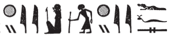

# Row D (433-440) {-}

## Esna 433 {-}

  

- Location: Travée D
- Date: Uncertain
- [Hieroglyphic Text](https://www.ifao.egnet.net/uploads/publications/enligne/Temples-Esna004.pdf#page=88){target="_blank"}    
- [Epigraphic Copy](https://www.ifao.egnet.net/uploads/publications/enligne/Temples-Esna004.pdf#page=173){target="_blank"} 
- Bibliography: @lieven-himmel, pp. 120-123; @altmann-mond, pp. 625-626 (excerpts).
  

^1^ *wnn (tȝ)-sn.t qȝ.tw r ȝḫ.t*  
*ẖr wnm.t n.t Rʿ*  
*ḥr sḥḏ hrw *  
*n bȝ.w ʿnḫ.w n nṯr.w*  
*ḥnʿ tpy.w-tȝ*  
*(m) ḫprw=f *  
*n ḫnty-nḏm-ʿnḫ*  
   
*ṯz.tw r p.t*  
*ẖr ỉȝbt.t n.t ỉʿḥ*  
*wbḫ.n=s grḥ*  
*m-ḫt hrw*  
*r snḫn ḥȝw n Wsỉr*  
*m st.wt=f*  
*r srnp bȝ *  
*n nṯr ʿȝ* ^2^ *m ỉmnt.t *  
*m ptr=f*  
*ḥnʿ ḥtpty.w *  
*ỉmy.w ỉmḥ.t*  
*m ỉrw=f nfr*  
*n ḫnty-ỉtr.ty-šmʿ*  
  
^1^ Esna reaches up to the horizon,    
bearing the right-eye of Re,  
illuminating the day   
for the living Bas of the gods  
as well as those on earth,  
(in) his manifestation  
of **Foremost of Nedjem-ankh**;[^fn-433-1]   
  
it is raised up to the sky,  
bearing the left-eye of the Moon,  
it lights up the night   
after daytime,    
to rejuvenate the body of Osiris  
with his rays;   
to make young the Ba   
of the great god ^2^ in the West  
from beholding him,    
along with the blessed dead  
who are in the Grotto,   
in his good visible form,   
of **Foremost of the Chapel of Upper Egypt**.[^fn-433-2]  

[^fn-433-1]: This is one of the Seven Khnums, who similarly appears in [Esna 449], 1 as the morning sun.
[^fn-433-2]: For this epithet of Khnum as the moon or evening sun, see also [Esna 415].

*wnm.t ỉȝbt.t*  
*ẖnm(.w) ỉmỉ.tw=sn*  
*ỉtn Ỉtm m*  
*ʿnḫ*  
   
*sḥḏ wr*  
*sḥḏ tȝ.wy*   
*m mȝwy=f *  
*ʿnḫ=sn n mȝȝ st.wt=f*  
*ḫʿỉ=f m ỉtn*  
*ḫnty ḥr.t rʿ-nb*  
*m-ẖnw skt.t mʿnḏ.t*  
   
*ḫy wr*  
*ḫy.n=f s(w) r ȝḫ.t*  
*grg nỉw.wt spȝ.wt*  
*n kȝ=f*  
  
The right and left eyes,  
are united among them,   
namely the day (Aten) and night sun (Atum)   
in life.  
  
The Great Illuminator,   
who illumines the two lands   
with his radiance,  
they live from seeing his rays;  
he appears as the sun disk (Aten),  
within the sky, every day,    
within the night bark and day bark.  
  
The Great Riser,  
he rises to the Akhet:[^fn-433-3]    
cities and nomes are founded  
for his Ka.

[^fn-433-3]: {width=24%} - The reading of this passage is not fully certain. There are similar epithets related to the verb *ḫy*, "to rise up; raise up" (*LGG* V, 638-639). Presumably the verb here is used reflexively.

*nfr.wy ḫʿỉ=k*  
*ẖnmw-Rʿ nb tȝ-sn.t*  
*ỉw=k m p.t*  
*m ỉwn wr*  
*wbn.tw rʿ-nb mỉ Rʿ*  
   
*wbn=k ḥtp=k*  
*nn wš=k ḏr ỉȝḫw*  
*ẖn n=k ỉḫm.w-wrḏ.w*  
*sqd n=k ỉḫm.w-sk.w*  
*m šms=f rʿ-nb*  
  
How beautiful is your appearance,  
Khnum-Re Lord of Esna!  
You are in the sky  
as the great Iun-pillar,  
rising daily just like Re.  
   
As you rise so you set,    
without fail since the Luminous One;  
as the indefatigable stars row for you,   
so the imperishable stars sail for you,    
in his (Re's) service, daily.

