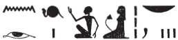

## Esna 434 {-}

  

- Location: Travée D
- Date: Commodus
- [Hieroglyphic Text](https://www.ifao.egnet.net/uploads/publications/enligne/Temples-Esna004.pdf#page=89){target="_blank"}  
- Bibliography: @lieven-himmel, pp. 124-127; @altmann-mond, pp. 626-627.

*wn(.w) ʿȝ.wy p.t*  
*sn(.w) ʿȝ.y Nw.t*  
*psḏ wḏȝ(.t) n ỉr.t-nb.w*  
   
*ʿnḫ Wsỉr ỉmy=s m ỉʿḥ*  
*tp ȝbd smd.t*  
*ḥr sḥḏ grḥ mỉ hrw*  
   
*nb bỉȝy.t*  
*sr ỉỉ(.w) nb.w*  
*mȝwy=f bs=sn ḥr-ʿ*
  
*nb wrš rʿ-nb*  
*sḫp(r) hrw.w wnw.wt*  
*ỉr ȝbd.w*  
*tr.w wr.w pw*  
*ḥr ʿq-pr*  
  
The doors of heaven are open,    
the doors of Nut are open:  
the *wedjat*-eye appears[^fn-434-0] for everybody.[^fn-434-1]  
  
Osiris comes alive in it as the moon,  
monthly during the 15th-day festival,[^fn-434-2]   
illuminating the night like the day.  
  
Lord of oracles,  
who announces all that is to come,    
and his radiance appears immediately.  
  
Lord of time, every day,  
who creates days and hours;   
that is, He who makes months   
and great seasons,    
while coming and going.[^fn-434-3]  

[^fn-434-0]: This text seemingly describes the upper tableau on the nearby Row D ([Esna 435]), in which divinities surround an enormous full moon, within which is a large *wedjat*-eye.
[^fn-434-1]: {width=20%} - Previous translators read this literally as "all whom Re made." While that interpretation is certainly possible, this seems more likely to be a spelling of *ỉr.t-nb.t*, "everybody (lit. all eyes)" (*Wb*. I, 107, 3-4), with the "Re" incorrectly attracted due to the common phrase "Eye of Re", and the preceding mention of the *wedjat*-eye.

[^fn-434-2]: {width=10%} - Reading suggested by @kurth-olz, p. 31 (star = 5, Horus = 10, *nb* a variant of the *ḥb*-basket). The alternatives proposed by @altmann-mond, pp. 626-627, n. 173, are less convincing.

[^fn-434-3]: That is, Osiris-Moon makes it possible to distinguish days, months, and seasons as he waxes, wanes, and moves about the sky,

*Ỉsdn wr ḥr ḥsb*  
*ỉ[p?] wḏȝ(.t)*  
*wḏȝ.tw m dbḥ.w*  
   
*ḫy n nḥḥ*  
*rnp n ḏ.t*  
*ḏd.tw ḥr nb=sn r=f*  
*nḥḥ ḏ.t pw*  
   
*wn n=f ỉḫm.w-wrḏ.w*  
*ḥr ỉr(.t) n=f ỉrw=sn*  
*ỉḫm.w-sk.w*  
*ḥr sḫd (r) dwȝ.t*  
   
*zȝ-Rʿ*  
*nb ḫʿ.w*  
*(qʿmʿts ʿntnyns n(ty)-ḫwỉ)|*  
*ʿnḫ(.w) ḏ.t nḥḥ*  
  
Great Isden, reckoning  
and accounting the *wedjat*-eye,  
made sound (*wḏȝ.tw*) with (its) pieces.  
  
The child of *nḥḥ*-eternity,  
youth of *ḏ.t*-eternity,   
so one calls their lord:  
namely, '*nḥḥ*-eternity and *ḏ.t*-eternity.'  
  
To him exist the Indefatigable stars,  
performing their duties for him,  
and the Inperishable stars  
descending (into) the Duat.  
  
The Son of Re,  
Lord of Appearances,  
(Commodus Antoninus Augustus)|  
may he live for all eternity.

