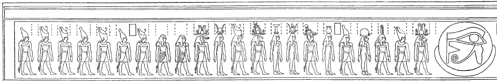
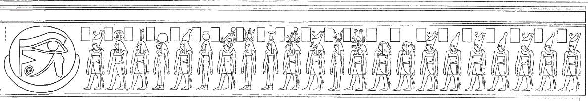

## Esna 435 {-}

- Location: Travée D
- Date: Uncertain
- [Hieroglyphic Text](https://www.ifao.egnet.net/uploads/publications/enligne/Temples-Esna004.pdf#page=90){target="_blank"}  
- Bibliography: @lieven-himmel, pp. 127-132; @altmann-mond, pp. 628-629; @mendel-himmel, pp. 439-440.

**Left**  
  
{width=99%}
  
  
**Right**  
  
{width=99%}
Symmetric scenes of 22 divinities facing the full moon with *wedjat*-inside. On the left, Khnum-Re Lord of Esna leads the procession, followed by a variant of the Theban Ennead (Atum, Shu, Tefnut, Geb, Nut, Osiris, Isis, Nephthys, Thoth, Horus, Hathor, and Sobek). On the right side, Khnum is replaced with Khepri.   
  
Behind that initial group are Hu (Utterance) and Sia (Perception), then 7 crowned gods with similar features. That final group is unique to Esna, and appear to be local ancestors. They receive funerary offerings (incense and cool water) in *Esna* VII, 564. On a large scene from inside the pronaos, the same gods, albeit without crowns, praise Khnum within the sundisk: *Esna* VI, 546.
  
