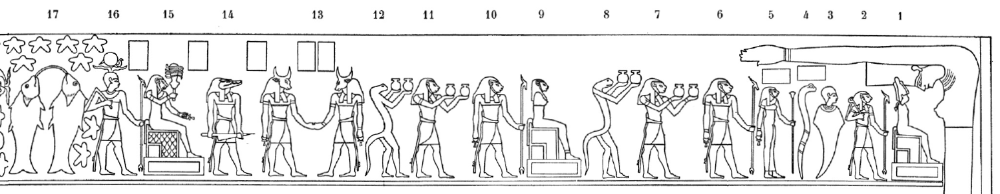
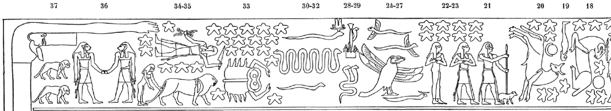

## Esna 443 {-}
  
- Location: Travée E
- Date: Unknown
- [Hieroglyphic Text](https://www.ifao.egnet.net/uploads/publications/enligne/Temples-Esna004.pdf#page=103){target="_blank"}  
- Bibliography: @lieven-himmel, pp. 148-152; @mendel-himmel, pp. 454-457.

These reliefs contain a combination of Zodiac signs, planets,[^fn-443-0] decans, and "arrows" of Bastet-Sekhmet,[^fn-443-1] all from the northern sky. Only traces of their captions are preserved in paint, but they can be identified based on parallels on other astronomical scenes, for which see @mendel-himmel, pp. 454-457.  

[^fn-443-0]: With the notable exceptions of Venus and Mercury: @lieven-himmel, pp. 156-157.
[^fn-443-1]: For the arrows of Bastet, see primarily @sauneron-tutu, pp. 278-281; @rondot-arrows, pp. 264-265; @rondot-tutu, pp. 314-321.

For the Zodiac signs from this table, see already @sauneron-4, p. xiv. One might compare the similar representations from the round zodiac of Dendera: @aubourg, p. 4, and photos from the [Louvre](https://collections.louvre.fr/en/ark:/53355/cl010028871){target="_blank"}. For general interest, I note some of the highlights below.

**Right (West)**  
{width=99%}  
  
**1-12**: Decans and pseudo-decans   
**13-14**: 2nd and 1st arrows of Bastet-Sakhmet 
**15-16**: Two more decans  
**17**: Pisces  

**Left (East)**  
{width=99%}

  
**18**: Aries  
**19**: Another decan   
**20**: Taurus and the moon  
**21**: Another decan ("the shepherd")  
**22-23**: Gemini  
**24-32**: Various serpents and a crocodile-headed, four-winged bird  
**33**: Cancer  
**34**: Jupiter  
**35**: Leo, followed by Coma Berenices?  
**36-37**: 4th arrow  

