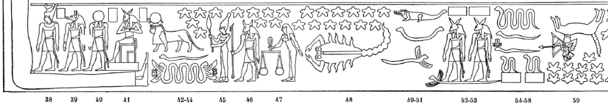
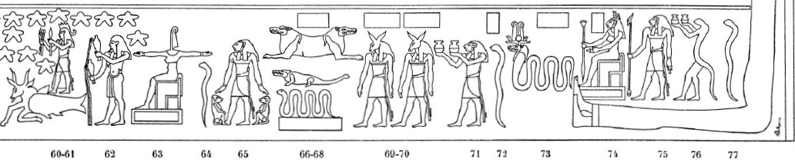

## Esna 445 {-}
  
- Location: Travée E
- Date: Unknown
- [Hieroglyphic Text](https://www.ifao.egnet.net/uploads/publications/enligne/Temples-Esna004.pdf#page=103){target="_blank"}  
- Bibliography: @lieven-himmel, pp. 154-158; @mendel-himmel, pp. 459-462.

These reliefs contain a combination of Zodiac signs, planets,[^fn-445-0] decans, and "arrows" of Bastet-Sekhmet,[^fn-445-1] all from the southern sky. Only traces of their captions are preserved in paint, but they can be identified based on parallels on other astronomical scenes, for which see @mendel-himmel, pp. 454-457.  

[^fn-445-0]: With the notable exceptions of Venus and Mercury: @lieven-himmel, pp. 156-157.
[^fn-445-1]: For the arrows of Bastet, see primarily @sauneron-tutu, pp. 278-281; @rondot-arrows, pp. 264-265; @rondot-tutu, pp. 314-321.

For the Zodiac signs from this table, see already @sauneron-4, p. xiv. One might compare the similar representations from the round zodiac of Dendera: @aubourg, p. 4, and photos from the [Louvre](https://collections.louvre.fr/en/ark:/53355/cl010028871){target="_blank"}. For general interest, I note some of the highlights below.

**Left (West)**  
{width=99%}  
  
**38-41**: 5th Arrow    
**42-44**: Tutu (chief of the 7 Arrows) above two serpents  
**45**: Virgo holding a grain of wheat (the star "Spica")  
**46**: Saturn  
**47**: Libra  
**48**: Scorpio  
**49-51**: crocodile and serpents  
**52-53**: 7th Arrow  
**54-58**: Serpents  
**59**: Sagittarius  

**Right (East)**  
{width=99%}
  
**60-61**: Capricorn (below) beneath Mars (above)  
**62**: Aquarius-Hapi    
**63-68**: More decans and pseudo-decans  
**69-70**: 6th Arrow  
**71-77**: More decans  
  