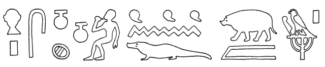

# Architrave F (449) {-} 

## Esna 449 {-}

  

- Location: Architrave F
- Date: Uncertain
- [Hieroglyphic Text](https://www.ifao.egnet.net/uploads/publications/enligne/Temples-Esna004.pdf#page=113){target="_blank"}  
- [Epigraphic Text](https://www.ifao.egnet.net/uploads/publications/enligne/Temples-Esna004.pdf#page=179){target="_blank"}
- Bibliography: @lieven-himmel, pp. 160-163; @altmann-mond, p. 631 (excerpts).
  

^1^ *gb.t ỉʿ.tw*  
*nn ḥty.t ỉm=s*  
*ỉw ḫnty-nḏm-ʿnḫ wbn(.w)*  
*m-ḫnt=s*  
*mỉ psḏ-m-nbw m-ḥȝ.t *  
*nḫn m wnm.t*  
   
*ḫnty-tȝ.wy-nṯr.w*  
*m ỉwn*  
*ḏȝỉ=f ḥr.t*  
*nḥȝ-ḥr bṯn(.w) m wnw.t=f*  
*nṯr.w nṯr.yt*  
*ỉb=sn nḏm(.w)*  
*ḥnmm.wt m sns n ḥr=f*  
   
*ʿḥʿ ḫnty-pr-nṯr*  
*m ʿḥʿy*  
*m bȝ (ḥr.w) 4*  
*ḥr nḥb.t* ^2^ *wʿ.t*  
*ḥr sḫp(r) ʿḥʿ-ḥms*  
*n zȝ.w-n=sn m ḫm.w*  
*m ḥnw=f*  
*m mȝʿ-ḫrw=f r ʿȝpp*  
*ỉr.n=f ḫfty.w=f m tm-wn*  
*st.wt=f pẖr.tw*  
*ḫnty ỉdb.w-Ḥr*  
*sʿnḫ srq-ḥty.t*   
*n mȝȝ=f*   
   
^1^ The sky is washed clean,  
without clouds in it,   
**Foremost of Nedjem-ankh**[^fn-449-1] is risen  
within it,  
just like He who rises in Gold in the beginning,  
the child in the right eye.[^fn-449-1b]   
  
**Foremost of the Lands of the Gods**  
is the pillar of air,   
as he sails across the sky;  
Neha-her is subdued in his hour.  
Gods and goddesses,   
their hearts are pleased,   
and the sunfolk make praises before him.  
  
**Foremost of Per-netjer** stops (*ʿḥʿ*)    
at noon (*ʿḥʿy*),  
as the Ba with four (heads)  
upon one ^2^ neck,[^fn-449-2]   
producing meals    
for the Guardian Deities in the shrines     
from his own temple service,  
as he has been justified over Apophis,  
having made his enemies non-existent;[^fn-449-3]   
his solar rays go around   
throughout the Shores of Horus,   
and mortals[^fn-449-3b] are enlivened    
(merely) from seeing him.

[^fn-449-1]: This inscription identifies different phases of sun throughout the day and night with five epithets of Khnum, all beginning with "Foremost". The first two belong to the canonical group of Seven Khnums, as noted by @kurth-olz, col. 29; see also @pichel, pp. 79, 83-84. The next three appear to be local adaptations, incorporating Per-netjer (North Esna, with its divine necropolis).
[^fn-449-1b]: For the morning sun as a child within the solar disk, see [Esna 437], 2.
[^fn-449-2]: This is yet another reference to Khnum as the quadrifrontic ram of Mendes, depicted elsewhere as the midday sun: [Esna 437], 5.
[^fn-449-3]: The battle between Apophis and the guardians of the solar bark typically takes place in the evening or morning, but here the zenith/midday (*ʿḥʿy*) seems to evoke the "standstill (*ʿḥʿw*)" of the solar bark upon encountering the giant serpent: @borghouts-apopis, p. 115, with n. 1. Presumably Re rewards his protectors for slaying Apophis by allowing them to eat from his own temple offerings. 
[^fn-449-3b]: While this would seem to read ("allowing throats to breathe"), obviously throats can not see the sundisk. Rather, this phrase is used throughout Esna as a designation for humans: @sauneron-5, p. 169.

*sḥḏ.n=f hrw=f*  
*m wnm.t=f*  
*m ḫprw=f nfr*  
*n ḫnty-nb-ʿnḫ*  
   
*bd.n=f snk *  
*m ỉȝbt.t=f*  
*m ỉrw=f *  
*n ḫnty-tȝ-n-nṯr *  
^3^ *ḥr snḫn ḥʿw*  
*n nṯr m ỉmnt.t*  
*m qy sfy rnp*  
*ḥtp nṯr.w n ptr=f*  
*ḥnʿ ỉmy.w dwȝ.t*  
*nty.w ỉm*  
  
As he illumined his day  
with his right eye (the sun),   
in his good manifestation    
of **Foremost of Neb-ankh**,  
  
so he dispelled darkness  
with his left eye (the night-sun?)[^fn-449-4]  
in his visible form   
of **Foremost of the Land of God**,  
^3^ rejuvenating the body   
of the god[^fn-449-5] in the West,   
namely as a rejuvenated child;  
the gods are pleased to behold him,  
along with those within the Duat,  
and those who are *there* (viz. the dead).

[^fn-449-4]: Ordinarily the left-eye would be the moon, but in the following lines this luminous deity brings light into the netherworld.
[^fn-449-5]: {width=28%} - The reading *nṯr* (crocodile = *nty*, pig = *r(r)*), was suggested by @meeks-architraves, p. 65, §171, n. 3 (followed by @altmann-mond, p. 631), and this would accord with Khnum's epithet here ("Foremost of the Land of *God*"). Context would suggest a god's name, such as Atum or Osiris, as in a similar passage in [Esna 433], 1, but that would require emending the pig hieroglyph to a giraffe: @lieven-himmel, p. 160, n. b.  

*wnm.t ḫʿ.tw*  
*ỉʿb.t mḥ.tw*  
*(ḥr) ḫy sḫd*  
*ḥr wbn ḥtp*  
*r-mn mỉn rʿ-nb*  
   
*mn ỉrw=sn r-ḥn.ty*  
  
The right-eye has risen,  
the left-eye is filled,   
ascending and descending,  
rising and setting  
until this very day, forever.  
  
May their forms endure for the limits of eternity!  

