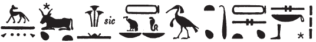

# Row F (450-454) {-}

## Esna 450 {-}

  

- Location: Travée F
- Date: Uncertain
- [Hieroglyphic Text](https://www.ifao.egnet.net/uploads/publications/enligne/Temples-Esna004.pdf#page=114){target="_blank"}  
- Bibliography: @lieven-himmel, pp. 164-171, Pl. 4; @mendel-himmel, pp. 505-506.
- Parallel: [Esna 413]  
  

^1^ *wnn zȝ(.w) Sȝḥ *  
*m p.t rsy.t*  
*ḏd-mdw*  
   
*ỉỉ.tw ʿnḏ.tw *  
*nn ḫfty=k*  
*ỉm(ȝ)-ỉb n Rʿ r=k*  
*zȝ=k Ḥr*  
*m nḏty=k*  
*m wbȝ wȝ.t m-ḥȝ.t(=k)*  
   
*šm=k m ḥʿʿ*  
*nn snḏ=k*  
*r hȝ(w) Ỉwnw*  
*m s.t-ỉb=k*  
   
*ẖnm=k*   
*m ỉȝbt.t*  *n.t Ỉtm*  
*ʿnḫ=k rnp=k ỉm=s*  
  
^1^ Orion (*sȝḥ*) is protected (*zȝ*)   
in the southern sky.  
Words spoken:   
    
You have arrived, being healthy,   
without your enemy!  
Re is gracious towards you;   
your son, Horus,   
is as your avenger,   
opening a path before (you).  
  
May you go in jubilation,  
without your fearing,   
to the area of Heliopolis,   
in your favorite place,   
  
so you might unite   
with the left-eye of Atum,    
through which you live and rejuvenate.

*ʿq=k m tȝ*  
*mỉ Ḫprỉ*  
*pẖr=k dwȝ.t m ḥʿʿ*  
*ʿpy* ^2^ *bȝ=k m-ḫt Rʿ*  
*zmȝ mȝwy=f m sʿḥ=k*  
   
*ḫʿỉ=k m dwȝw*  
*ḥtp=k m mšrw*  
*Rʿ pw wn=k ḥwn.w*  
   
*mỉ r pr=k*  
*qȝ psḏ.t ḥr s.t=sn*  
*mr nṯr.w šzp tw [...]*  
   
As you enter in the earth,  
like Khepri,  
so you traverse the Duat in joy,  
and your Ba ^2^ flies up after Re,  
as his rays unite with your mummy.  
  
As you rise in the morning,  
so you set in the evening:  
that means Re, when you are young again.   
  
Come to your temple!  
The Ennead is high upon their places,    
the gods love to receive you [...]  

^3^ *wnn ḥr.t gnḫ.w m ḥb*  
*hȝy hȝy.ty ỉry-wḥm*  
*ḫft ḏ(d).w=s*  
   
*sṯ.t ḥȝ Mnḥy.t rn=s*  
*sq(ȝ.t) bȝ.w *  
*ḥqȝ(.t) pw n p(ȝ) bnw r-ȝw=f*  
   
*wpš(.t) ḥr.t *  
*sḥḏ(.t) ỉmy=s*  
*sqȝ(.t) dwȝw*  
*m Nw.t rsy.t*  
*psš.n=f Nw.t ḥnʿ Rʿ*  
   
*sqd=s ḥnʿ=f*  
*nn ḥr=s r=f*  
*m Spd.t ḥnw.t ḫȝbs.w*  
   
*spḥ(.t) msḫtw*  
*m p.t-mḥy.t*  
*tm rdỉ.t sḫd=f r dwȝ.t*  
  
^3^ The sky and stars are in festivals,  
the twin-skies (*hȝy.ty*) and solar course rejoice (*hȝy*) 
because of her words, namely:  
    
Sothis, indeed, Menhyt is her name,   
she who exalts the Bas,[^fn-450-1]    
she is the ruler of the entire earth!  
  
She who brightens the sky,  
and illumines what is inside it,  
she who elevates Orion  
in the southern sky (Nut),  
so he shares Nut along with Re.   
  
She sails along with him,    
never leaving him,    
as Sothis, Mistress of the decans.  
  
Lassoing the Great Dipper[^fn-450-2]     
in the Northern sky,  
not letting him descend to the Duat.

[^fn-450-1]: {width=35%} - Largely following the suggestion by @kurth-olz, cols. 29-30, who did not explain the *ḥȝ*-sign after "Sothis", nor translate the epithet after "her name." Menhyt would thus be spelled using acrophony: *mn < mnš*, "cartouche", *n < nb.ty*, *ḥ < ḫ < ȝḫty.t*. Multiple texts from Esna identify Menhyt with Sothis, e.g. *Esna* III, 233, 17 (13); 251, 25, §9; 

[^fn-450-2]: This could be another epithet of Sothis (so @lieven-himmel, pp. 164-165), but it is typically the action of Ipet-weret, not Sothis. For this reason I understand the verb as an infinitive, a caption to the depiction of Ipet-weret in [Esna 451].