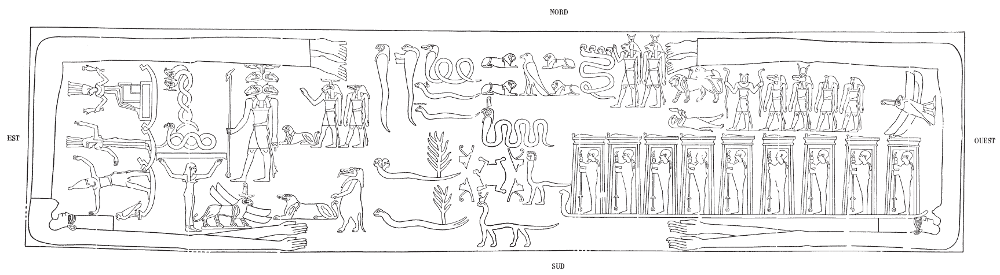

## Esna 451 {-}

- Location: Travée F
- Date: Unknown
- [Hieroglyphic Text](https://www.ifao.egnet.net/uploads/publications/enligne/Temples-Esna004.pdf#page=115){target="_blank"}   
- Bibliography: @lieven-himmel, pp. 171-175; @mendel-himmel, pp. 490-507.  
  
{width=99%}  

This scene has no carved inscriptions, but @sauneron-4, p. 69, n. a, already noted one could detect traces of the painted captions. Further cleaning by the join Egyptian-German team will undoubtedly reveal more labels.   
  
Among various figures, one may recognize Orion and Sothis and Anukis on the east side. Two gods of the winds appear on either side, both with ram heads and four wings, but one with a lion's body (left = South Wind, see *Esna* II, 105) another with that of a falcon (right = West Wind, see *Esna* II, 162, 19).   
  
Other astral beings can be compared to depictions on other temple ceilings. New texts concerning some of the elaborate snakes (especially the snake carrying 9 different Ptahs) have recently been published from the 26th Dynasty tomb of Iufaa from Abusir: @iufaa-snakes, @iufaa-book-snakes, @iufaa-selqet. For detailed commentary, consult the works noted in the bibliography. 