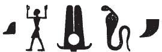
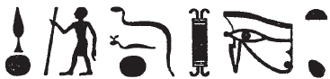

## Esna 454 {-}

- Location: Travée F
- Date: Domitian 
- [Hieroglyphic Text](https://www.ifao.egnet.net/uploads/publications/enligne/Temples-Esna004.pdf#page=120){target="_blank"}  
- Bibliography: 

^1^ *ʿnḫ nṯr nfr*  
*ṯḥn ḫʿ(.w) mỉ Ḥr*  
*m nswy.t mn(.w) *  
*ḥr ns.t n Rʿ*  
*ḥqȝ*  
*n nb tȝ.wy*  
*(twmṯyns ḫwỉ)|*  
   
^1^ Live the good god,  
scintillating of appearance like Horus   
in a kingship established  
upon the throne of Re,  
and the rule   
of the Lord of the Two Lands  
(Domitian Augustus)|    
  

 

  
^2^ *mry ẖnmw-Rʿ*   
*ḥry s.t=f wr.t m Ỉwny.t*   
*nṯr ʿȝ (m) kȝr=f*  
*qȝ šw.ty*  
*nb ḫbzw.t*  
*ḥȝỉ Ḥʿpỉ r-ḫt=f*  
  
^2^ Beloved of Khnum-Re  
upon his great throne in Iunyt,  
great god (in) his shrine,  
tall of double plumes,  
lord of a beard,[^fn-454-1]    
at whose order Hapi surges.  
  

[^fn-454-1]: {width=15%} - The ideogram of the divine beard is thicker than usual, but compare similar examples in *Esna* II, 12, 14; *Esna* III, 264, 26; *Esna* VII, 554, 16.

^3^ *mry Wsỉr (wnn-nfr mȝʿ-ḫrw)|*  
*nsw.t[-nṯr.w]*  
*nsw.t m [p.t]*  
*ḥqȝ m tȝ*  
*ỉty ʿȝ m dwȝ.t*  
*nṯry-nỉwty m spȝ.wt nb.w*  
*nṯr ʿȝ ḥry-ỉb tȝ-sn.t*  
  
^3^ Beloved of Osiris (Wennefer justified)|  
King [of the gods];  
king in heaven,  
ruler on earth,   
great sovereign in the Duat;    
City God in all nomes,      
great god within Esna.
  

^4^ *mry Ḥkȝ p(ȝ) ẖrd*  
*ʿȝ wr tpy n ẖnmw*  
*wr-ḥkȝw kȝ n Rʿ*  
*ḫy(?) wr*  
*ḏfḏ n wḏȝ.t*  
*ỉȝw rnp*  
*zbỉ nḥḥ*  
*wbn rʿ-nb*  
  
^4^ Beloved of Heka the Child  
the eldest, first-born of Khnum,  
Greatest of Magic, Ka of Re,  
great child(?)[^fn-454-2],  
iris of the *wedjat*-eye,  
old man who rejuvenates,  
who traverses eternity,  
and shines every day.  

[^fn-454-2]: {width=20%} - The epithet is unclear, the tree sign can write *ḫ(.t)*, so perhaps together with the the circle (*ḫ*) it is an spelling of *ḫy*, "child." Elsewhere Heka is the "good son (*zȝ nfr*) and iris of the *wedjat*-eye: *Esna* II, 72, 13.