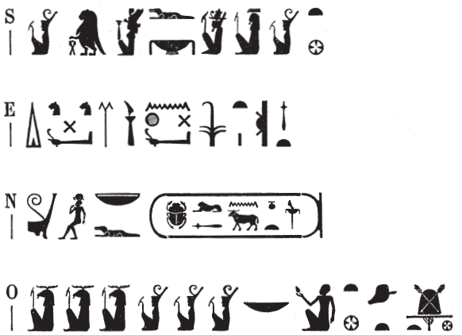

## Esna 461 {-}

  

- Location: Top of column 1  
- Date: Trajan
- [Hieroglyphic Text](https://www.ifao.egnet.net/uploads/publications/enligne/Temples-Esna004.pdf#page=131){target="_blank"}  
- Bibliography: @sayed-neith, II, p. 658, Doc. 1082b; see also [Tempeltexte 2.0](http://www.tempeltexte.uni-tuebingen.de/portal/#/text-detail/2826){target="_blank"}  

NB: As is typical for the summits of columns, the following texts employ many sportive writings of local divinities and epithets, relying heavily on anthropomorphic ideograms. For this reason, the full texts will be reproduced here, rather than multiple images in the text notes.  
  
The text abbreviations (S,E,N,O) in the following columns refer to the cardinal directions in Sauneron's French edition. They correspond to: S(outh), E(ast), N(orth),  O(uest) = W(est). The French abbreviations are kept here to assist the reader comparing the hieroglyphic texts.  
  
Sauneron published the inscriptions clockwise and counter-clockwise, but this usually splits up the divine epithets from the sacred names. Accordingly, I have translated the texts in a different sequence. Just as on the column bases, one text (the divine epithets) proceeds from a starting point in one direction, then the second text (benefits for the king) proceed from the same starting point in the opposite direction.  
  
{width=50%}  
   

^S^ *N.t wr.t*  
*mw.t-nṯr nb(.t) tȝ-sn.t*  
^O^ *(ỉt)-ỉt.w*  
*(mw.t)-mw.wt*  
*nb.t zȝw *  
*ḫnt(.t) N.t*   
   
^E^ *dỉ(.t) pḥty*    
*m qn nḫt*  
*nswy.t ʿȝ.t*  
^N^ *n zȝ-Rʿ*  
*nb ḫʿ.w*  
*(trʿns nt-ḫwỉ)|*  
   
^S^ Neith the great,    
Mother of god, Lady of Esna,  
^O^ (Father) of Fathers,  
(Mother) of Mothers,[^fn-461-1]  
Lady of Sais,    
foremost of the Neith nome;   
  
^E^ (she who) gives strength,     
as a mighty victory,  
and a great kingship  
^N^ to the Son of Re,  
Lord of Appearances,  
(Trajan Augustus)|  
  

[^fn-461-1]: Following the reading suggested by @sayed-neith, II, p. 658, n. 3. Compare a clearer example of this epithet with four Khnums and Neiths in [Esna 463], O, and similarly [Esna 466], O. 