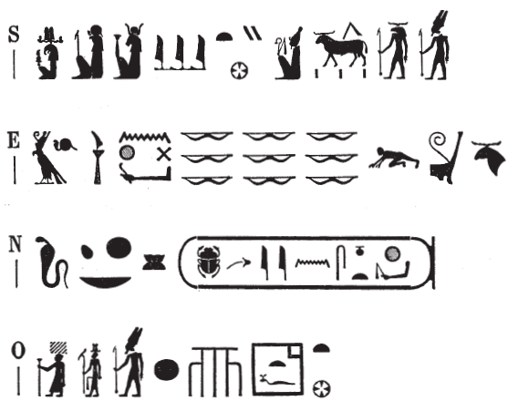

## Esna 462 {-}

  

- Location: Top of column 2  
- Date: Trajan
- [Hieroglyphic Text](https://www.ifao.egnet.net/uploads/publications/enligne/Temples-Esna004.pdf#page=131){target="_blank"}  
- Bibliography: 

{width=50%}
  

^S^ *ẖnmw-Rʿ nb sḫ.t*  
*nsw.t nṯr.w*    
*nṯr ʿȝ* ^O^ *ʿnḫ*  
*ḫnty ḥw.t-ỉt*  

^E^ *rdỉ(?) qn nḫt*  
*pḏ.t 9 ḫb(.w) *  
*n šfy.t* ^N^ *n zȝ-Rʿ*  
*nb ḫʿ(.w)*  
*(tryns nty-ḫwỉ)|*  
  
^S^ Khnum-Re Lord of the Field,  
King of the Gods,  
great living ^O^ god  
foremost of Temple of the Father.[^fn-462-1]     
  
^E^ who gives(?)[^fn-462-1b] might and victory,    
the Nine Bows falling down    
to the prestige ^N^ of the Son of Re,  
Lord of Appearance(s),  
(Trajan Augustus)|  

[^fn-462-1]: The understanding of the epithets here are based on *Esna* III, 350, 8-9 = *Esna* VI, 475, 6-7, where most of the same phrases occur, albeit in slightly different order. Presumably the ideogram of Amun writes both *aA*, "great" and *nfr*, "good"; the former value is well-attested elsewhere: @klotz-philae, p. 67, No. 14.  
[^fn-462-1b]: It is unclear how to read the Horus figure at the beginning of this line. It appears in the same position in [Esna 470], E, as well as at the beginning of two architrave texts: [Esna 424], 1; [Esna 431], 1. In the later two cases, it appears to write *wnn*, but could also just be an emblematic sign to begin the text. In all the surrounding texts from the column summits, one expects a form of the verb *rdỉ*, "to give" here.