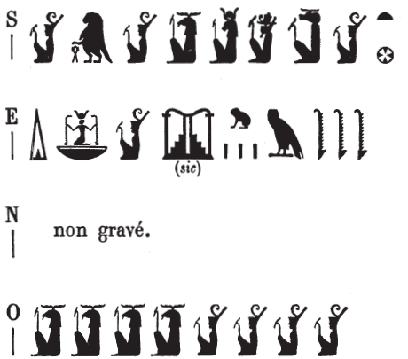

## Esna 463 {-}

  

- Location: Top of column 3  
- Date: Unknown
- [Hieroglyphic Text](https://www.ifao.egnet.net/uploads/publications/enligne/Temples-Esna004.pdf#page=132){target="_blank"}  
- Bibliography: @sayed-neith, p. 658, Doc. 1082c.

{width=40%}
  

^S^ *N.t wr.t*   
*mw.t-nṯr*    
*nb.t tȝ-sn.t*  
^O^ *ỉt-ỉt.w*   
*mw.t mw.wt*  
^E^ *dỉ(.t) ḥḥ n ḥb.w-sd.w*    
*ḥfn.w m rnp.wt*   
  
^S^ Neith the great,   
Mother of God,   
Lady of Esna,  
^O^ Father of fathers,   
Mother of mothers,  
^E^ who gives millions of Sed-festivals  
and myriads of years.

