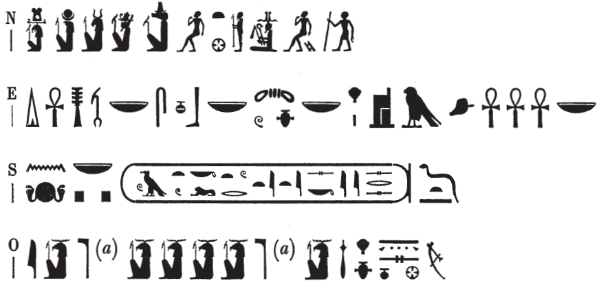

## Esna 464 {-}

  

- Location: Top of column 4  
- Date: Titus
- [Hieroglyphic Text](https://www.ifao.egnet.net/uploads/publications/enligne/Temples-Esna004.pdf#page=132){target="_blank"}  
- Bibliography: 

{width=65%}
  

^N^ *mry ẖnmw-Rʿ nb tȝ-sn.t*  
*Ptḥ-Ṯnn *  
*Nwn wr*  
^O^ *ỉt nṯr.w*  
*nṯr ʿȝ ḥry-ỉb tȝ-sn.t*  
   
^E^ *dỉ ʿnḫ-ḏd-wȝs nb*  
*snb nb ȝw.t-ỉbt nb*  
*ḥr s.t-Ḥr *  
*ḫnty ʿnḫ.w nb*  
^S^ *n nsw.t-bỉty*  
*nb tȝ.wy*  
*(ȝwtwkrtwr tỉtỉs kysrs)|*   
*ʿnḫ(.w) ḏ.t*  
  
^N^ Beloved of Khnum-Re Lord of Esna,  
Ptah-Tatenen,   
Nun the great,  
^O^ Father of the gods,  
Great god within Esna.  
  
^E^ He who gives all *ʿnḫ-ḏd-wʿs*,  
all health, all happiness  
upon the throne of Horus,  
foremost of all the living,  
^S^ for the King of Upper and Lower Egypt,  
Lord of the Two Lands,  
(Autokrator Titus Caesar)|  
may he live forever!  

