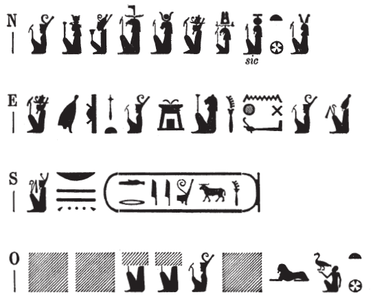

## Esna 465 {-}

  

- Location: Top of column 5  
- Date: Trajan
- [Hieroglyphic Text](https://www.ifao.egnet.net/uploads/publications/enligne/Temples-Esna004.pdf#page=133){target="_blank"}  
- Bibliography: @sayed-neith, p. 658, Doc. 1082d.

{width=50%}
  

^N^ *N.t wr.t *  
*mw.t-nṯr*  
*nb.t tȝ-sn.t *  
*štȝ.t* ^O^ *[wr.t]*  
*[...] nb(.t) Zȝw*  
   
^E^ *dỉ(.t) nswy.t ʿȝ.t*  
*m ȝw.t-ỉb*  
*pḥty qn nḫt*    
*n nsw.t* ^S^ *bỉty*  
*nb tȝ.wy*  
*(dryns (nty)-ḫwỉ)|*  
   
^N^ Neith the great,  
Mother of god,  
Lady of Esna,  
[great] ^O^ mysterious one   
[...] Lady of Sais.  
  
^E^ She who gives[^fn-465-1] a great kingship  
in happiness,   
strength, victory, and might[^fn-465-2]    
to the King of Upper ^S^ and Lower Egypt,  
Lord of the Two Lands,   
(Trajan Augustus)|  

[^fn-465-1]: Remarkably the ideogram of Geb, identifiable by his typical crown, who writes *tȝ* in "Esna" in the epithet of Neith (above ^N^), here represents the verb *dỉ*, "to give", a phonetic variant of *tȝ*: see already @kurth-1, p. 140, No. 67.
[^fn-465-2]: Here Neith represents the uniliteral *m* (< *N.t*, or from *mw.t-(nṯr)*, "mother of god"), and the temple-shaped pectoral writes *ȝw.t-ỉb*, the usual name for that amulet.  Presumably the lioness-goddess represents *pḥty*, "strength", usually spelled with the hieroglyph of a lion's rump, but also written with a standing lion: cf. *Philä* II, 401, 2 and 8; @klotz-philae, pp. 93-94, n. o. For the three types of strength grouped together, see also [Esna 461], E.