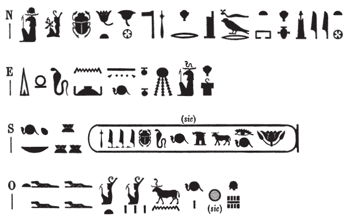

## Esna 466 {-}

  

- Location: Top of column 6  
- Date: Uncertain, but the other texts on column 6 are all from the reign of Trajan
- [Hieroglyphic Text](https://www.ifao.egnet.net/uploads/publications/enligne/Temples-Esna004.pdf#page=133){target="_blank"}  
- Bibliography: 

{width=55%}
  

^N^ *ẖnmw-Rʿ nb tȝ-sn.t*  
*nṯr ʿȝ ḥry s.t=f wr.t*  
*ḥry-ỉb Ỉwny.t*  
^O^ *ỉt-ỉt.w*  
*mw.t-mw.wt*  
*wbn zp tpy*  
   
^E^ *dỉ(=ỉ) šnw nb n ỉtn*  
*wbn=ỉ ḥr=s*  
^S^ *(n) zȝ-Rʿ*  
*nb ḫʿ.w*  
*(ȝwtkr(twr) ksʿrs)|*  
  
^N^ Khnum-Re Lord of Esna,  
great god upon his great throne  
within Iunyt;  
^O^ Father of fathers,  
Mother of mothers,  
who arose (in) the first moment.  
  
^E^ (I) give the whole circuit of the sundisk,  
over which I shine,   
^S^ (to) the Son of Re,  
Lord of Appearances  
(Autokra(tor) Caesar)|  

