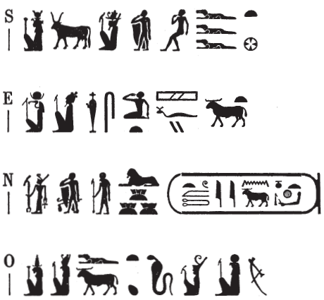

## Esna 467 {-}

  

- Location: Top of column 9
- Date: Domitian  
- [Hieroglyphic Text](https://www.ifao.egnet.net/uploads/publications/enligne/Temples-Esna004.pdf#page=133){target="_blank"}  
- Bibliography:  
  
{width=40%}
  

^S^ *mry Nb.t-ww nb.t tȝ-sn.t*  
^O^ *mḥn.t nt Rʿ*  
^E^ *dỉ(.t) wsr ḥz.wt šfy.t*  
^N^ *n zȝ-Rʿ*  
*nb ḫʿ.w*  
*(twmṯyns nty-ḫwỉ)|*  
  
^S^ Beloved of Nebtu, Lady of Esna,   
^O^ the coiled uraeus of Re,[^fn-467-1]   
^E^ who gives might, praise, and prestige    
^N^ to the Son of Re,   
Lord of Appearances,    
(Domitian Augustus)|

[^fn-467-1]: This epithet was identified already in *LGG* III, 390c. The *atef*-crown is a distinguishing feature of Mehit: see *Edfou* IX, Pls. 30a-b; @spencer-samanud, pp. 64, 68, 71; and [this temple relief](https://commons.wikimedia.org/wiki/File:The_lion_goddess_Mehit_and_the_god_Onuris-Shu_from_Sebennytos,_Ptolemaic_period,_ca._316-10_BCE,_Ny_Carlsberg_Glyptotek,_Copenhagen_%2835612917313%29.jpg){target="_blank"} from Sebennytos. Horus writes *ḥ(r)*, the crocodile writes *nt* (*Wb*. II, 355, 12) and the ram writes *t* < *ṯȝy*, "male."