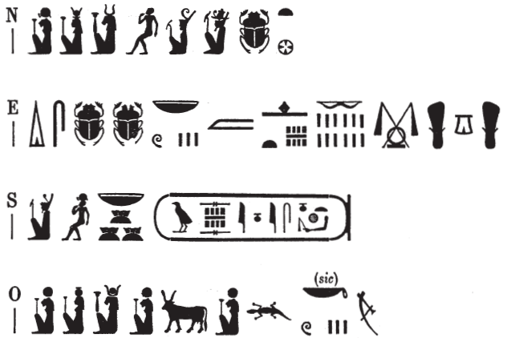

## Esna 468 {-}

  

- Location: Top of column 10
- Date: Vespasian
- [Hieroglyphic Text](https://www.ifao.egnet.net/uploads/publications/enligne/Temples-Esna004.pdf#page=133){target="_blank"}  
- Bibliography:  
  
{width=50%}
  

^N^ *mry Mnḥy.t-nb.t-ww nb.t ḫnt-tȝ*  
^O^ *Bȝst.t nb.t wpy*  
*nb.t tḫ*  
*ʿšȝ ḥb.w*  
   
^E^ *dỉ=s tȝ.w nb.w m ḥtp*  
*pḏ.t 9.t dmḏ(.w) ẖr ṯb.ty*  
^S^ *n zȝ Rʿ*  
*nb ḫʿ.w*  
*(wspsyns nty-ḫwỉ)|*  
  
^N^ Beloved of Menhyt-Nebtu Lady of Khent-ta,  
^O^ Bastet(?) Lady of *wpy*-festival,  
beloved of inebriation(?),[^fn-468-1]  
numerous of festivals.    
    
^E^ May she give all lands in peace,   
and the Nine Bows bound under the sandals    
^S^ of the Son of Re,   
Lord of Appearances,   
(Vespasian Augustus)| 

[^fn-468-1]: The interpretation of the epithets remain highly speculative. There are three ideograms of Menhyt, and at least two signs (cow goddess and cow) which could write *nb.t*, "lady." Nonetheless, the most common epithets preceding *ʿšȝ-ḥb.w* for both Menhyt and Nebtu are *nb.t-wpy* and *nb.t-tḫ*. Perhaps for the first, the figure of Nut writes *nb.t*, while the seated cow writes wp because of her horns. In the second example, the final Menhyt figure could be an ideogram for *tḫ*, "inebriation."