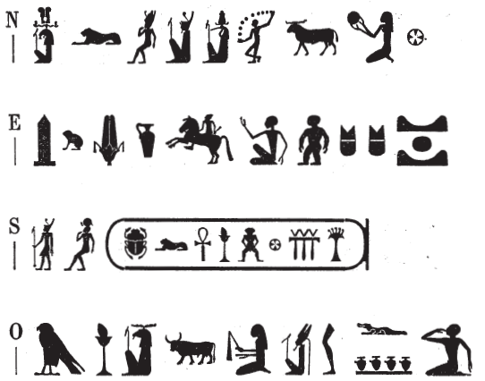

## Esna 469 {-}

  

- Location: Top of column 11  
- Date: Trajan
- [Hieroglyphic Text](https://www.ifao.egnet.net/uploads/publications/enligne/Temples-Esna004.pdf#page=135){target="_blank"}  
- Bibliography: @leitz-rams, p. 271 (excerpt)

{width=45%}
  

^N^ *ẖnmw-Rʿ nb tȝ-sn.t*  
^O^ *ḥry nḥp*  
*nb qd*  
*ỉqd r mr=f*  
   
^E^ *dỉ(.w) ḥqȝ nfr*  
*ḥzy(?) qn*   
*n/m ḥn.ty nḥḥ*   
^S^ *n zȝ-Rʿ*  
*(trʿns nty-ḫwỉ)|*  
   
^N^ Khnum-Re Lord of Esna,[^fn-469-1]  
^O^ Chief of the Potter's Wheel,  
Lord of building,   
who fashions (on the wheel) as he desires,[^fn-469-2]  
  
^E^ who gives a good rule,[^fn-469-3]  
praise(?) and victory[^fn-469-4]   
for the limits of eternity,   
^S^ to the Son of Re,   
(Trajan Augustus)|[^fn-469-5]   

[^fn-469-1]: This name involves a certain amount of acrophony. "Re" is spelled *r(w)* (< "lion") + *ʿ* (< "child"). In the toponym, *tȝ* < "Thoth" (see [Esna 467], E), *s* (< *sṯỉ*), *n* (< *nṯr*, "god"), *t* (< *dḫn*, "to set a rhythm"). The final sign might also write *n < nhm*, "to rejoice; make music", but then there would be two *n*'s.
[^fn-469-2]: @leitz-rams, p. 271, No. 41, read this passage quite differently: *pȝ nḥp* ("the potter"), *kȝ šps* ("august bull"), *Ỉmn-rn=f*, "hidden of name," ther latter via acrophony (*r < rd* "foot", *n < nty*, "crocodile", *f < fdw*, "four (jugs)"). While the falcon can write *pȝ*, a far more common epithet of Khnum at Esna is "Chief of the Potter's wheel." The epithet "august bull" is not otherwise attested in the temple (*LGG* VII, 272c, cites two New Kingdom examples).  
    The present interpretation is based on the phrases which most often occur alongside "Chief of the Potter's wheel": *nb qd* (bull = *nb*, mummy = *qd*; cf. *Wb*. V, 75), and *ỉqd r-mr=f*. For the latter, Amun = *ỉ* (cf. *Esna* III, 379, 24: *ỉḏr.w*, "limits"), the leg = *qd* (< *qdỉ*, "to move around", determined with this sign: *Wb* V, 78, 1), crocodile = *r* (@leitz-rams, p. 271), and the four milk jugs = *mr* (< "milk jug", *Wb*. II, 105, 18), while the man writes the suffix-pronoun (*=f*), via substitution of similar signs.
[^fn-469-3]: The obelisk = *dỉ* (< *tḫn*, "obelisk"); frog = *ḥqȝ* (< Heqet, the frog-goddess); *nfr* < Nefertem.
[^fn-469-4]: These signs are somewhat uncertain. Tentatively suggesting the first vessel is a variant of the *ḥz*-ewer. The man on a horse is a relatively rare sign, which elsewhere writes *qn*, "victory; might": @kurth-1, p. 197, No. 8; @guermeur-cheval.
[^fn-469-5]: Several signs in this cartouche derive their uniliteral values from acrophony: *t < tȝ* (scarab); *r < rw*, "lion"; *ʿ < ʿnḫ*, "life"; *n < nḥp*, "potter's wheel", *s < sṯỉ*, "to ejaculate" (frontal man); *n < nỉw.t*, "city"; *ty* < *ṯḥn*, "to scintillate"; *ḫwỉ* < "fan." 