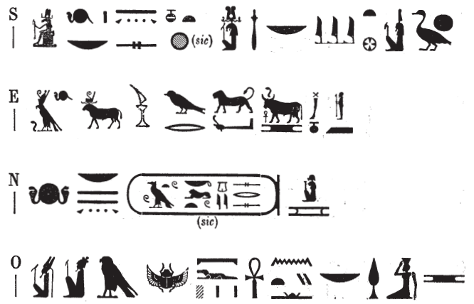

## Esna 470 {-}

  

- Location: Top of column 15  
- Date: Uncertain
- [Hieroglyphic Text](https://www.ifao.egnet.net/uploads/publications/enligne/Temples-Esna004.pdf#page=135){target="_blank"}  
- Bibliography: 

{width=50%}
  

^S^ *mry ẖnmw-Rʿ nb tȝ-sn.t*  
*nṯr ʿȝ nb sḫ.t*  
*Šw zȝ-Rʿ*  
^O^ *nṯr ʿȝ ʿnḫ*  
*ḥry nṯr.w*  
*ʿnḫ nty nb ỉm=f*  
   
^E^ *Ḥr nb qn*  
*wr pḥty*  
*mry Ḥp wḥm n Ptḥ*  
^N^ *nsw.t-bỉty*  
*nb tȝ.wy*  
*(ȝwtwkrtw(r) gysrs)|*  
*mry Mnḥy.t*  
   
^S^ Beloved of Khnum-Re Lord of Esna,    
Great god, Lord of the Field,    
Shu, son of Re,  
^O^ Amun, great living god(?),[^fn-470-1]  
chief of the gods,   
all that exists lives from him.   
  
^E^ The Horus, Lord of might,  
great of strength,    
beloved of Apis, herald of Ptah.   
^N^ King of Upper and Lower Egypt,   
Lord of the Two Lands,    
(Autokrato(r) Caesar)|  
beloved of Menhyt.

[^fn-470-1]: The interpretation of the first signs are not entirely clear. Similar epithets of Khnum Lord of the Field occur in *Esna* III, 328, A: "Great living god, chief of all the gods." Presumably the falcon writes *nṯr*, Osiris writes *ʿȝ*, and the flying scarab writes *ʿnḫ*, as elswhere, e.g. *Esna* III, 298, A and B; 377, 6.