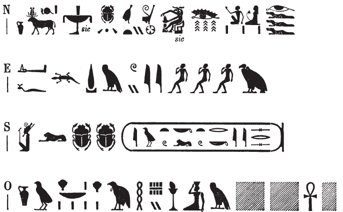

## Esna 471 {-}

  

- Location: Top of column 16
- Date: Uncertain, but the rest of column 16 dates to the reign of Domitian
- [Hieroglyphic Text](https://www.ifao.egnet.net/uploads/publications/enligne/Temples-Esna004.pdf#page=136){target="_blank"}  
- Bibliography:  
  
{width=48%}
  

^N^ *ẖnmw-Rʿ nb tȝ-sn.t*  
*qdỉ rmṯ.w*  
*ỉr nṯr.w*  
^O^ *ẖnm ḥr.w-nb.w ḥr nḥp=f*  
*m [sḫm/rn=f n ḫnty Pr-]ʿnḫ*  
   
^E^ *dỉ=f ʿšȝ ḏȝm.w*  
*n* ^S^ *nsw.t bỉty*  
*nb tȝ.wy*  
*(ỉwtwkrtwr kysrs)|*  
  
^N^ Khnum-Re Lord of Esna,  
who fashioned humans,  
and made the gods,  
^O^ who forms everybody on his wheel,  
in [his form/name of Foremost of Per]-ankh.[^fn-471-1]  
  
May he give numerous generations  
to ^S^ the King of Upper and Lower Egypt,  
Lord of the Two Lands,  
(Autokrator Caesar)|. 
  

[^fn-471-1]: Restored after *Esna* II, 15, 12-13; 17, 40; with a slight variant in  *Esna* III, 249, 1, §16. See @pichel, pp. 66-67. 
