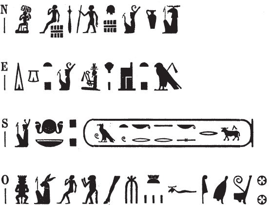

## Esna 472 {-}

  

- Location: Top of column 17
- Date: Uncertain, but the rest of column 17 dates to the reign of Trajan
- [Hieroglyphic Text](https://www.ifao.egnet.net/uploads/publications/enligne/Temples-Esna004.pdf#page=136){target="_blank"}  
- Bibliography:  
  
{width=38%}
  

^N^ *Ḥkȝ p(ȝ)-ẖrd*  
*ʿȝ wr tpy n ẖnmw*  
^O^ *bs štȝ*  
*ḫy nfr*  *wḥm-msḫʿ.w=f*  
*m šmʿ-mḥw*  
   
^E^ *dỉ ns.t n.t Ṯnn*  
*ḥr s.t-Ḫr*  
^S^ *n nsw.t-bỉty*  
*nb tȝ.wy*  
*(ȝwtwkrtr ksrs)|*  
  
^N^ Heka the Child,  
eldest, first-born of Khnum,  
^O^ mysterious form,    
good child,   
who repeats his luminous births  
in Upper and Lower Egypt.  
  
^E^ He who gives the throne of Tatenen,    
together with the throne of Horus  
^S^ to the King of Upper and Lower Egypt,    
Lord of the Two Lands  
(Autokrator Caesar)|

