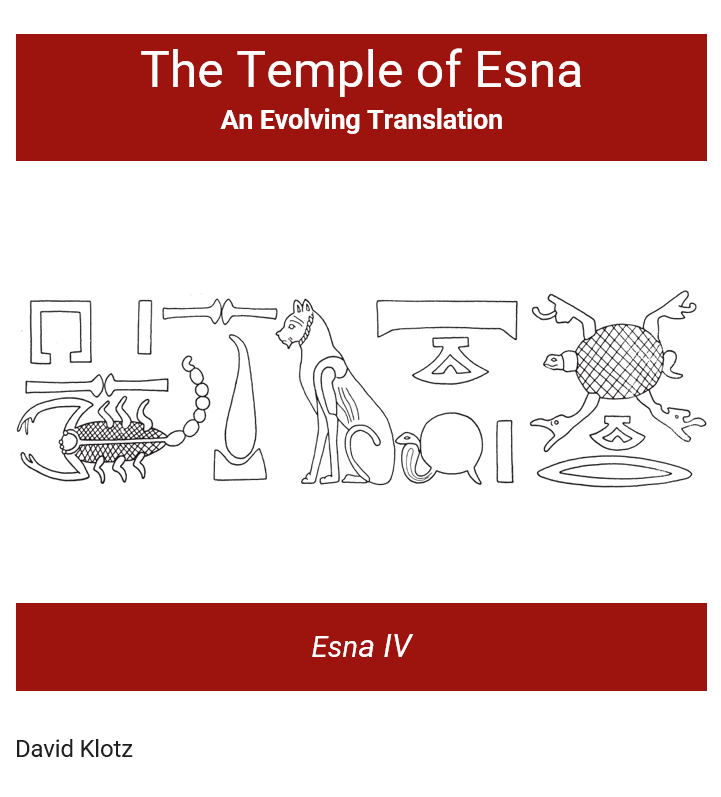

--- 
title: "The Temple of Esna. An Evolving Translation: Esna IV"
author: "David Klotz"
date: "`r Sys.Date()` (latest update)"
site: bookdown::bookdown_site
documentclass: book
bibliography: [book.bib]
csl: institut-francais-darcheologie-orientale.csl
html_document:
    number_sections: false
link-citations: yes
cover-image: "images/Esna4Cover.png"

output:
  bookdown::gitbook:
    split_bib: no

---

# Esna IV {-}  
[{.cover width="250"}](https://bookdown.org/shemanefer/Esna4)

## Introduction {-}

##### *David Klotz* {-}
  
This is a continuation of my ongoing quest to translate all the Roman inscriptions from Esna temple. The previous two volumes are now complete, and can be found here: [Esna II](https://bookdown.org/shemanefer/Esna2) and [Esna III](https://bookdown.org/shemanefer/Esna3). I will continue to make changes and updates to those, including some  desperately needed proof-reading. 

### The Present Volume {-}

*Esna* IV covers the architraves along the ceiling of the pronaos. The ceiling of the temple was conceived in antiquity as a replica of the sky, so constellations and other astronomical figures were projected over this space. As such, many of the texts are captions to the various figures, while the longer inscriptions link various astrological concepts to the local theology of Esna. 

Many of the longer texts were already translated with commentary by @lieven-himmel, with alternate readings by @kurth-olz. The very detailed, over-sized hieroglyphs along the architraves were analyzed by @meeks-architraves. Finally, the representations of the various stars, decans, and constellations have been analyzed elsewhere, most recently by @mendel-himmel. 

In the past few years, a joint Egyptian-German project has carefully removed soot from the ceiling and columns, revealing newly visible painted details, particularly affecting the captions and iconographic details of the astronomical figures. Progress so far has been published in @leithy-esna and @leithy-esna-2. One may also compare  [various](https://uni-tuebingen.de/en/university/news-and-publications/press-releases/press-releases/article/spectacular-ceiling-frescoes-discovered-in-the-temple-of-khnum-at-esna/) [media  reports](https://uni-tuebingen.de/en/university/news-and-publications/press-releases/press-releases/article/the-temple-of-esna-in-full-color/) on this amazing work, as well as a recent (October 2022) lecture on the subject by Prof. Christian Leitz:

```{r echo=FALSE}
knitr::include_url("https://www.youtube.com/embed/WGZiRJfNYZI")
```
  
  
All the published volumes of Esna temple were recently (2021) released as [open-access PDFs by the IFAO](https://www.ifao.egnet.net/publications/catalogue/Temples-Esna/). Each translation will contain a link to the original hieroglyphic text, and details about major secondary literature. Originally I had linked to the bibliographical database Tempeltexte 2.0 from the University of Tübingen, but that website has been down since January 2022.

```{r progress, echo=FALSE}

n_total <- length(list.files(pattern = "Esna-"))

```
So far, **`r n_total`/75 (`r round(100.0*n_total/75, 1)`%)** of the texts from Esna IV are complete and online. As with previous volumes, the present transliterations and translations are provisional, and I plan to proofread and standardize spellings after I have completed the remaining Esna volumes, and prepare comprehensive indexes.
  
## Contribute! {-}

I welcome any feedback for this project, whether regarding the format, corrections, alternative suggestions for translations, or notes to any important references I might have overlooked. Or perhaps you would like to volunteer to translate certain texts!  You may contact me directly at <shemanefer@gmail.com>. I will of course fully acknowledge any suggestions, and add you to the list of contributors.  

I would also appreciate help with relevant bibliography, especially newer journal articles or monographs. I already have most basic references in digital or paper form, but if you noticing any major omissions, please let me know. 

## Contributors {-}

Daniel Arpagaus; Maged Mahgoub; Abraham I. Fernández Pichel; Nicola Barbagli